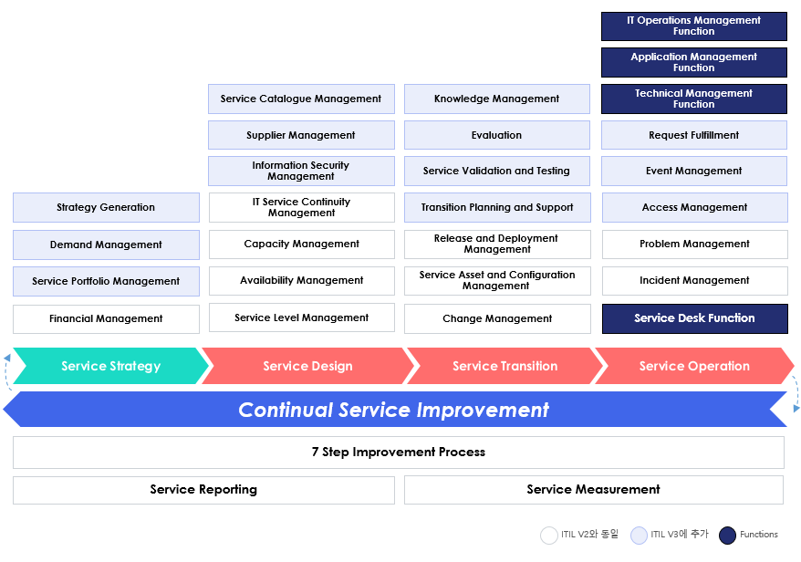

# ITIL (IT 정보 라이브러리)

## ITIL V1
1980년대 영국 정부는 CCTA(Central Computer and Telecommunications Agency)라는 정부 조직이 IT 자원을 효율적으로 활용할 수 있도록 하는 지침을 개발하도록 지시했다. 그 결과 오늘날 'ITIL'로 알려진 IT 조직을 위한 베스트 프랙티스 카탈로그의 초창기 모델이 만들어졌다.

## ITIL V2 - ITIL의 핵심 요소가 구성되다.
ITIL V2는 2000년부터 2001년 사이에 발표됐다. IT 관리, 응용 프로그램, 서비스 등  분야별 IT 프로세스 가이드 라인을 다루는 8권의 문서가 출판되었다.

IT 서비스 중심으로 고객에게 효과적인 서비스를 제공하는데 필요한 다방면의 프로세스를 정의한다. 사실상 현재 ITIL의 기본 틀이 모두 V2에서 마련되었다고 할 수 있다.

V2의 서비스 제공 및 지원 프로세스는 V3, V4에서도 여전히 핵심 요소로 기능하고 있다.

## ITIL V3 - 지속적 서비스 개선을 강조

> 서비스 라이프사이클(Service Lifecycle) 접근 방식을 도입하여, IT 서비스 관리의 전 과정을 다루는 구조로 발전했습니다. 각 서비스는 시작부터 종료까지의 모든 단계를 체계적으로 관리

ITIL V3의 라이프라이클 모델을 세부 프로세스와 기능 수준에서 보다 자세히 표현하면 위와 같다. 흰색으로 표시된 프로세스는 V2에 포함된 프로세스로, V3로 진화하며 5단계 라이프사이클에 포함되며 반복적으로 순환하는 구조를 따르게 되었다. 

### 예시: 신규 IT 서비스 출시
1. Service Strategy: 회사는 새로운 클라우드 기반 파일 저장 서비스를 출시하려고 합니다. 서비스 전략 단계에서, 시장 조사를 통해 고객의 요구를 분석하고, 이 서비스가 회사에 어떤 비즈니스 가치를 제공할지 결정합니다. 주요 목표는 중소기업을 대상으로 안정적인 파일 저장 솔루션을 제공하는 것.
2. Service Design: 서비스 설계 단계에서, 클라우드 파일 저장 서비스의 기술적 요구 사항을 정의하고, 서버 인프라, 데이터 보안, 사용자 액세스 관리 등을 설계합니다. 이 단계에서는 보안 정책, 가용성, 확장성, SLA(Service Level Agreement) 등도 결정합니다.
3. Service Transition: 설계된 서비스를 실제 운영 환경으로 전환하는 단계입니다. 새로운 시스템을 테스트하고, 고객에게 영향을 미치지 않도록 파일 저장 서비스가 순조롭게 배포되도록 계획합니다. 이 과정에서는 IT 팀과 고객 지원 팀이 전환을 관리하고 필요한 문서와 교육 자료를 준비합니다.
4. Service Operation: 서비스 운영 단계에서 클라우드 파일 저장 서비스는 실질적으로 고객에게 제공됩니다. 고객이 문제를 보고하거나 지원이 필요할 경우, IT 지원 팀이 이를 해결하며, 성능 모니터링과 유지보수가 지속됩니다.
5. Continual Service Improvement: 서비스가 운영되면서 수집된 데이터를 기반으로 성능을 개선하는 단계입니다. 고객 피드백을 반영하여 더 나은 기능을 추가하거나, 서비스 안정성을 높이기 위한 조치를 취합니다.

## ITIL V4 - Service Lifecycle에서 Service Value System으로 변화하다.

> 유연성, 속도, 그리고 현대적 IT 환경을 반영하여, 특히 애자일(Agile), 데브옵스(DevOps), 리눅스, 클라우드 컴퓨팅 등 최신 기술과 관리 방식을 수용. 전통적인 프로세스 기반 접근에서 벗어나 **서비스 가치 시스템(Service Value System, SVS)**를 중심으로 한 유연한 프레임워크를 도입.

2011년 ITIL V3 개정 후 전 세계적인 IT 환경 변화가 있었다. 클라우드 환경으로의 변화, DevOps의 등장 등 급속도로 변화하는 조직 내 IT 환경에 ITIL V3는 민첩한 대응이 어려웠다. 이에 따라 2019년 V3가 V4로 개정되었다. 서비스 가치 체계(Service Value System, SVS)가 도입되었고 프랙티스 중심의 IT관리, 클라우드 환경의 운영 절차가 강화되었다. 

### 애자일 소프트웨어 개발 및 배포
1. Service Value Chain(SVC): ITIL v4에서는 서비스 제공이 고정된 순서대로 진행되는 것이 아니라, **가치 사슬(SVC)**을 통해 더 유연하게 이루어집니다. 애자일 개발팀이 고객의 요구를 빠르게 반영하기 위해 작은 기능 단위를 반복적으로 개발하고, 서비스 배포를 자동화할 수 있습니다.
2. Service Value Streams: 고객의 요구에 따라 빠르게 새로운 소프트웨어 기능을 추가하기 위해 **지속적 통합(Continuous Integration)**과 지속적 배포(Continuous Deployment) 프로세스를 운영합니다. 이 과정에서는 개발, 테스트, 배포를 자동화하여 더 빠르고 안정적인 배포를 보장합니다.
3. 고객 피드백을 통한 지속적 개선: 서비스 배포 후, 고객 피드백이 즉시 반영되며, 고객이 서비스에서 불편을 겪는 부분이 있을 경우 빠르게 대응할 수 있습니다. 이를 통해 서비스는 고객에게 더 나은 가치를 제공하며 지속적으로 개선됩니다.
4. 애자일 및 DevOps 지원: v4의 **SVS(Service Value System)**는 애자일 및 DevOps와 같은 현대적 IT 프레임워크와의 통합을 지원합니다. 이를 통해 개발팀과 운영팀이 긴밀하게 협력하며, 새로운 서비스나 기능을 더 빠르고 안정적으로 고객에게 제공할 수 있습니다.

| 참조 : https://blog.naver.com/gsitm2006/222397568756

# ITIL V4의 주요 특징
ITIL V3의 핵심적인 변화는 5단계(서비스 전략→서비스 설계→서비스 전환→서비스 운영 및 지속적인 서비스 개선)로 구성된 ‘서비스 라이프사이클’의 도입이었다. ITIL V3의 세부 프로세스는 서비스 라이프사이클에 잘 녹아 들었다. 이렇게 지속적 서비스 개선에 초점을 맞춰 ITIL 프로세스를 구성하는 방식은 데밍 사이클(Deming Cycle)로 알려진 PDCA(Plan-Do-Check-Act) 사이클과 매우 유사하다. 

반면 ITIL V4는 ‘서비스 가치 사슬(Service Value Chain)’을 중심으로 기본 구조와 개념을 변경하였다. 프로세스 중심의 서비스 라이프사이클에 관한 내용 대부분을 삭제하고 프랙티스 중심, 가치 중심으로 적용 방법을 바꿨다. 이는 IT 서비스가 적용되는 조직의 업무 현실에 더욱 부합하는 방향으로의 변화라고 볼 수 있다. 또한 ITIL V4는 사일로(Silo) 감소, 협업 증가, 조직 커뮤니케이션 촉진, 애자일(Agile) 및 데브옵스(DevOps) 등을 ITSM 전략에 통합하도록 장려했다. 이렇듯 사용자 정의가 가능하도록 설계의 유연성을 높인 것이 눈에 띄는  ITIL V4의 특징이라고 할 수 있다.

## 내 생각 요약
### ITIL v2 기반
**ITIL v2**는 주로 **IT 서비스 운영과 지원**에 초점을 맞춘 프로세스 기반의 접근을 강조했습니다. 이를 통해 조직이 IT 서비스를 안정적으로 제공하고 관리하는 기본 개념을 형성했죠. 서비스 제공 및 지원에 대한 가이드를 제공하며, 서비스 안정성에 중점을 두고 있었습니다.

### ITIL v3 vs. ITIL v4
- ITIL v3는 안정적인 서비스 개발을 위한 프로세스 관리에 초점을 맞추었습니다. 이 버전은 서비스 라이프사이클 개념을 도입하여, 전략, 설계, 전환, 운영, 지속적 개선이라는 명확한 단계별 프로세스를 통해 서비스가 처음부터 끝까지 일관성 있게 제공될 수 있도록 관리합니다. 안정적인 서비스 제공이 목적이며, 프로세스 중심으로 체계적인 절차를 따릅니다. **변경 관리(Change Management)**나 서비스 배포는 매우 신중하고 계획적으로 이루어져야 합니다.
- ITIL v4는 애자일(Agile), DevOps, 클라우드 등 현대 IT 환경에서 필요한 유연하고 빠른 소프트웨어 개발을 위한 프로세스 관리에 초점을 맞추고 있습니다. **서비스 가치 시스템(SVS)**을 통해 유연한 서비스 제공 방식을 강조하며, 고정된 프로세스보다 가치 창출과 개선에 중점을 둡니다. v4는 신속한 피드백 루프, 반복적이고 빠른 개발 및 배포, 지속적 통합과 배포를 지원해 빠르게 변화하는 IT 환경에 대응할 수 있도록 설계되었습니다.

### 간단히 비교하면:
- ITIL v3: 안정성과 일관성을 중시하는 전통적인 프로세스 관리. 서비스가 단계별로 명확하게 관리되고, 신중한 변경 관리를 통해 안정적인 서비스 제공을 목표로 함.
- ITIL v4: 유연성과 속도를 중시하는 현대적인 프로세스 관리. 빠른 배포와 애자일한 개발을 지원하며, 고객의 요구에 맞춰 빠르게 적응하고 개선.