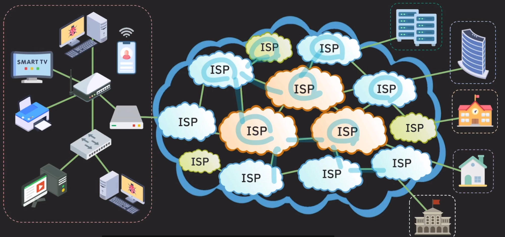

# 네트워크

[용어 정리](./TERM.md)

**네트워크란 네트워크 전체에서 어떻게 서로 다른 장치들이 데이터를 주고받고 소통하는지 이해하기 위해서입니다.**

즉 우리 개발자에게 네트워크에 대한 이해가 있어야, 클라이언트와 서버 간의 데이터 통신을 최적화하고, 발생할 수 있는 다양한 네트워크 문제를 해결할 수 있기 때문입니다. 이는 결국, 우리가 만드는 소프트웨어가 사용자에게 더 나은 경험을 제공하는 데 필수적입니다.

### LAN(local area network) - 가까운 곳 인터넷 연결 방법

인터넷(the netwokr or networks / the world’s largest WAN / global network) 연결되기 위해 IP 주소를 할당 받아야한다.

물리적으로 연결하기 위해서 케이블선과 모뎀을 연결해야한다.

모뎀에 공유기를 연결해야한다,

만약 공유기에 랜포트가 부족다면 스위치(허브)를 구매하면 된다.

    기술

    - Ethernet - 유선 통신
    - wireless LAN(wi-fi) - 무선 통신

### WAN(Wide area network) - 거리가 있는 곳 인터넷 연결 방법

어떻게 내가 가입한 ISP가 다른 컴퓨터와 통신할 수 있을까?

내가 특정 컴퓨터에 데이터를 전달하기 위해서는 내가 가입한 ISP에 데이터를 보내면 그 ISP가 다른 ISP로 ··· 최종적으로 원하는 서버에 데이터를 전달할 수 있다.

근데 ISP도 tier가 나뉜다.

1. tier 1 : 국제 범위의 네트워를 보유하고 있어서 인터넷의 모든 네트워크랑 연결이 가능하다. / 인터넷의 중추 역할을 한다.
2. tier 2 : 국가/지방 범위 네트워크 보유(skt, kt, lg 등) / tier 1 ISP에 비용을 내고 트래픽 전송
3. tier 3 : 작은 지역 범위 서비스 제공 / 상위 ISP에게 비용을 내고 인터넷 트래픽을 구매해서 서비스를 사용

    

**ISP 네트워크 간에는 어떻게 연결되는 걸까?**

내가 보낼라는 IP주소를 들고 라우터에게 물어보고 물어보고 물어봐서 간다.

---
우선 OSI 7 Layer를 배우는 이유부터 알아야겠죠?

<aside>
💡 결국 네트워크는 통신을 하기 위한 건데, 통신 기능이 제대로 동작하기 위해서는 네트워크만의 약속된 통신 방법이 있어야 한다.

</aside>

## OSI 7 Layer

### 네트워크 복습

**네트워크 :** 컴퓨터나 기타 기기들이 리소스를 공유하거나 데이터를 주고 받기 위해 유선 혹은 무선으로 연결된 통신 체계

**네트워크가 하는 일**

- 애플리케이션 목적에 맞는 통신 방법
- 신뢰할 수 있는 데이터 전송 방법
- 최적의 통신 경로 결정
- 목적지로 데이터 전송
- 노드 사이의 데이터 전송

### OSI Model이 생긴 이유

네트워크 통신을 위해 통신에 참여하는 주체들이 따라야 할 형식, 절차, 규약을 체계적으로 정의하기 위해 OSI 모델이 만들어졌습니다. 모든 통신 기능을 하나의 프로토콜로 구현할 수 없기 때문에, 각 기능을 모듈화하여 계층별로 나누는 것이 필요했습니다. 그래서 OSI 7계층 모델과 TCP/IP 스택(4계층)이 탄생하게 된 것입니다.

더 쉽게 설명하자면 각각의 계층이 서로 독립적인 성질을 띄기 때문에, 에러 발생 시에는 해당하는 계층의 장비 혹은 소프트웨어만 보수하면 됩니다.

### OSI 7 layer 배우기

<aside>
💡 **미리 요약해보기
application layer :** 애플리케이션에 필요한 통신 방법 제공
**presentation layer** : 애플리케이션 간의 통신 메시지 포맷 관리
**sesstion layer** : 애플리케이션 간의 통신 세션 관리
**transport layer** : 애플리케이션 간의 통신 담당
**network layer** : 호스트 간의 통신 담당
**data link layer** : 직접 연결된 노드 간의 통신 담당
**physical layer :** bit 단위의 data 전송

</aside>

**7 application layer**   
- 애플리케이션 목적에 맞는 통신 방법 제공
- HTTP, DNS, SMTP, FTP

**6 presentation layer**   
애플리케이션 간의 통신에서 메시지 포맷 관리

- 예: 인코딩 ↔ 디코딩, 암호화 ↔ 복호화, 압축 ↔ 압축 해제

**5 session layer**   
애플리케이션 간의 세션 관리 (연결, 유지, 종료)

**4 transport layer**   
- 애플리케이션 간 데이터 전송 관리
- TCP: 신뢰할 수 있는 데이터 전송
- UDP: 최소한의 기능 제공, 빠른 전송  

   
실제로 어떻게 목적지까지 찾아갈 것인가?   
**3 network layer**   
실제로 데이터를 목적지까지 안전하고 빠르게 찾아갈 수 있게 하는 프로토콜

- 데이터 패킷을 목적지까지 라우팅
- IP 주소 기반 통신
- 최적의 경로 결정 (라우팅)

어떻게 데이터를 전송할 것인가?   
**2 data link layer**   
물리 계층을 바탕으로 두 장치간에 데이터를 주고 받을 수 있ㄷ록 하는 계층 (투인트 투 포인트)
- 노드 간 데이터 전송, 오류 검출 및 수정
- 여기선 IP가 아닌 MAC 주소 기반 통신(ARP)
    - **ARP 프로토콜 :** IP주소를 MAC 주소로 변환해주는 프로토콜

**1 physical layer**   
데이터를 단순히 전달하는 것이 중요하다
- 물리적 매체를 통해 비트 단위 데이터 전송
- 케이블, 전파 등 실제 전송 매체
- 예. 허브, 리피터,, 네트워크 카드, 통신 케이블

**쉽게 요약해보기**   
데이터는 7계층부터 1계층까지 순서대로 포장됩니다. 그런 다음 데이터는 네트워크를 통해 전달되며, 중간에 있는 라우터는 1~3계층까지 확인하며 목적지 IP를 찾습니다. 목적지에 도달하면, 1계층부터 7계층까지 순서대로 포장을 풀어, 최종 데이터를 받는 것입니다.

### OSI 4 layer (TCP/IP stack)

- **Application Layer**: OSI의 7~5계층
- **Transport Layer**: OSI의 4계층
- **Internet Layer**: OSI의 3계층 (네트워크 계층)
- **Link Layer**: OSI의 2~1계층 (데이터 링크 및 물리 계층)