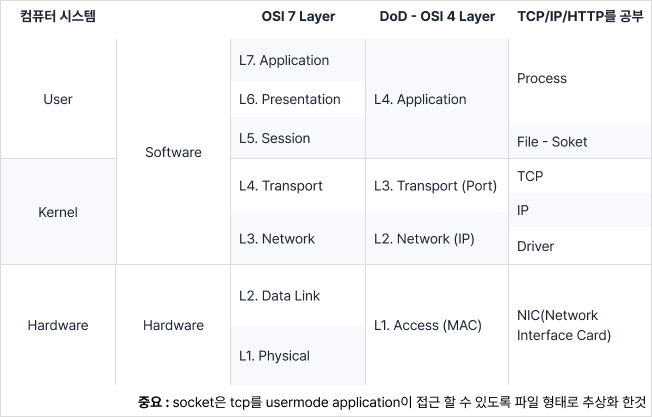
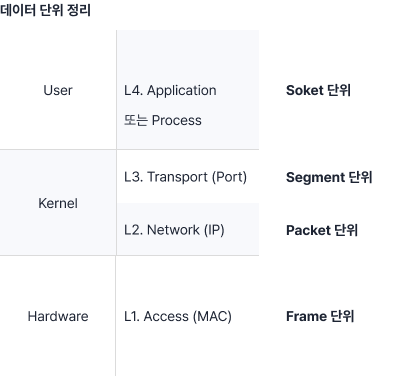
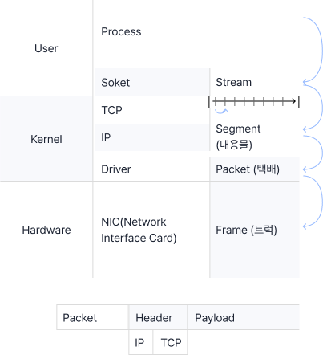
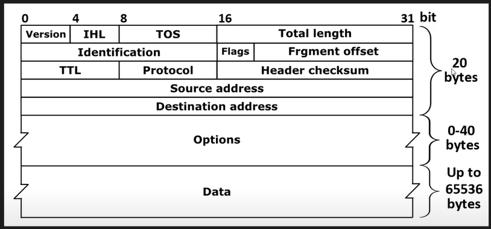

# 1
네트워크는 이렇게 공부해야한다.

무엇가를 알고 싶으면 그것에 대한 실체에 대해 먼저 공부를 하라고 한다. 
내가 어떤 여성을 좋아한다면 그 여성에 대해 알아야지 사람에 대한 공부부터 하면 안 되는데 이 강사는 이때 '사람'을 OSI 7 Layer라고 말한다. 




> 소켓 : TCP/IP를 유저 모델 어플리케이션에 접근할 수 있도록 파일 형식으로 추상화한 인터페이스


<br>


# 2
MAC주소, IP주소, Port번호가 식별하는 것

- **MAC** : 하드웨어 주소 / NIC(LAN 카드)에 대한 식별자
  - 하드웨어 주소 + 변경 가능
- **IP주소 (v4, v6)** : Host에 대한 식별자 (네트워크에 연결됐다.)
- - Host : 인터넷(네트워크)에 연결된 컴퓨터
  - NIC에 IP 바인딩을 n개 할 수 있다.
- Port 번호 : 업무에 따라 Port 번호는 정의가 달라진다.
  - process 식별자 / service 번호 / interface 번호
    - service : 네트워크에서 정의된 특정 기능 수행을 의미한다. 웹 서비스의 경우 http 서비스 식별자가 사용된다.
    - interface : LAN 케이블 단자는 컴퓨터가 속한 네트워크와 연결되는 장치와 연결하기 때문에 인터페이스라고 부르기도 한다.


<br>


# 3
Host, Switch, Network 이들의 관계에 대하여.

다시 한번 복습해보자
- **Host** : 네트워크에 컴퓨터가 연결된 컴퓨터
  - 네트워크 자체의 Host : Switch
  - 네트워크를 이용하는 Host : End-Point(단말)
- **Swich** : 네트워크 자체를 이루는 컴퓨터 (Router)
  - **End-Point** : 네트워크 이용주체 (Pear, Client, Server)
- **Network** : Internet
   - Internet : 라우터와 DNS의 집합체이다.


<br>


# 4
IPv4주소 체계에 대한 암기사항


IP주소와 Net-mast(서브넷 마스크)
    - IP주소 : Host에 대한 식별자

Network, Host, IP의 구별방법
- 대한민국에서 개인을 주민등록번호로 식별할 수 있다.
- = Network에서 Host를 IP로 식별할 수 있다.


- IP (Internet Protocol)
  - Internet : 복수의 통신망을 집합시킨 광역 통신망
  - Protocol : 규약, 규칙
- IP 주소
  - IPv4 : 32 bit 주소체계 = 43억개
  - IPv6 : 128 bit 주소체계
- 
    예시. 192.168.60.14 = 8bit.8bit.8bit.8bit = 32bit

    <details>
    <summary>2진수를 4비트씩 나눠서 16진수로 표현하기</summary>
    <div markdown="1">
        <ul>
            <li>1111(2) = 10(15) = F(16)</li>
            <li>(15 * 16) + (15 * 1) = 255</li>
            <li>만약 FFF라면 (15 * 16^2) + (15 * 16) + (15 * 1) = 4,095이다.</li>
        </ul>
    </div>
    </details>

<!-- 0~255 = 2^8 = 0000 0000 ~ 1111 1111 -->
        

IP를 나눴을 때 Class A/B/C Network를 바탕으로 어느 쪽은 네트워크 ID, 어느쪽은 호스트 ID가 된다. 즉 Net ID + Host ID.

<details>
    <summary>만약 Net ID가 24 bit일 때 Host ID는?</summary>
    <div markdown="1">
        <ul>
            <li>정답은 8 bit이다. </li>
            <li>왜냐 IPv4의 길이는 32 bit이기 때문이다.</li>
            <li>32bit(IP) - 24bit(Net ID) = 8bit(Host ID)</li>
        </ul>
    </div>
</details>


서브넷 마스크
IP 주소에서 Network ID의 길이를 알아내는 게 Subnet Mask이다. 서브넷 마스크는 기본적으로 자체 32비트 숫자를 이용하여 IP 주소를 마스킹하기 때문에 여기서 ‘마스크’라는 단어가 이용

> 서브넷 마스크는 IP 주소를 네트워크와 호스트로 나누는 기준 + 서로 같은 네트워크에 있는지 판단 + 서브넷마스크 없이는 IP 주소만 보고 네트워크 구조를 구분할 수 없다.

- 네트워크가 어디까지고, 호스트가 어디부터인지 구분을 하여 특정 네트워크 내에서만 통신이 이루어지도록 제한한다.
- 아!!! 네트워크로 여기까지 사용하고 있다. 즉 255.255.255.0은 8bit.8bit.8bit.0bit를 쓰고 있어서 24bit를 사용 중이다!
- 다른 예시
  - 192.168.123.132를 예로 들면 이 IP 주소에서 ‘192.168.123.’은 네트워크를 나타내며 ‘132’는 네트워크에 연결된 기기를 나타냅니다.
  - 네트워크 IP : 192.168.123.132 = 11000000.10101000.01111011.10000100
  - 호스트 IP : 255.255.255.0 = 11111111.11111111.11111111.00000000
  - 이 둘을 합치면 다음과 같다.
    - 11000000.10101000.01111011.00000000 (네트워크 주소: 192.168.123.0)
    - 00000000.00000000.00000000.10000100 (호스트 주소: 000.000.000.132)

서브넷
전 세계에 수백만 개의 네트워크가 존재하는데, 네트워크가 작은 조각으로 쪼개져 있는 경우 이런 조각을 서브넷이라고 합니다.

서브네팅
이러한 서브넷을 효율적으로 자원을 배분하는 것이다.


예시. IP 주소가 192.168.60.14이고 서브넷 마스크가 255.255.255.0이었다. // 여기서 비트 연산이 사용된다.
1. 192는 0xC0 == 1100 0000, 255는 0xFF == 1111 1111이다
     1100 0000
     1111 1111 이 두개를 AND 연산으로 bit 연산을 한다면
2. 1100 0000 으로 이 값은 192 그대로인데 
3. 14는 255와 AND 연산을 했을 때 0이 나온다.
4. 즉 둘을 비트연산을 하면 192.168.60.0이 되고 이게 네트워크 ID가 된다.


> 이걸 표기할 때 192.168.60.14(호스트 ID)/24(네트워크 ID)이고 이걸 용어로 표가헐 수도 있다/=.

<details>
    <summary>IPv4 주소가 172.30.1.63이고 서브넷 마스크가 255.255.255.0일 때 표기법은?</summary>
    <div markdown="1">
        <ul>
            <li>정답은 172.30.1.0/24 </li>
            <li>이유는 255.255.255 = 24비트 (Ne)</li>
        </ul>
    </div>
</details>


<br>


# 5
개발자 입장에서 Port번호 이해하기

Port 번호는 세 가지 의미로 해석될 수 있다.
- Process 식별자
- Service 식별자
- InterPace 번호


유저 모드   프로그램을 실행하면 프로세스
           TCP/IP가 유저 모드 어플리케이션이 접근할 수 있도록 인터페이스가 제공. 본질은 File이지만 Socket이라고 한다.
           이떄 TCP Socket일 경우 소켓의 정보 중 하나가 Port 번호이다.
           Port 번호는 16bit 정보이다. 경우의 수 = 2^16 -> 0 ~ 65,535인데 0과, 65,535빼고 사용한다.
커널 모드   TCP/IP + Driver

하드웨어    NIC


(하드웨어)              (커널모드)                      (유저모드)
어떤 컴퓨터가 있는데 그 컴퓨터의 IP가 192.168.0.10이고 프로그램이 2개(엣지, 크롬)가 실행이 된다.
이때 프로세스(실행된 프로그램) 엣지의 포트가 8080이라면 크롬의 포트는 8080이 될 수 없다.
즉 개발자의 입장에서는 Process 식별자가 되는 것이다.


> 프로토콜 분석하는 프로그램을 직접 개발해보면 쉽게 이해할 수 있다.


<br>


# 6
Switch가 하는 일은 Switching 이다.

| Network는 고속도로이다.
1. 교차로(Swich) 중에 경로&인터페이스를 선택하는 것이 Switching이다.
2. 최적화된 경로로 가기 위해서 이정표(라우팅 테이블)가 필요하다.


<br>


# 7
네트워크 데이터 단위 정리 (매우 중요!)



- User 모드 Application/Process 수준 = 즉, Socket 수준 = Stream 데이터
  - `Steam` 데이터는 그 끝을 알 수 없는 데이터이다. 
  - 그걸 네트워크로 보내기 위해서 분해(자르기)가 필요 = Segment
- 잘려진 조각 하나를 `Segment`라고 하는데 그걸 박스로 포장한 것을 `Packet`이라고 한다.
  - `Packet`의 최대 크기는 1500bytes이다.
- 이 Packet을 실어나르기 위해서는 다시 `Frame`에 넣는다.


<br>

# 8
네트워크 인터페이스 선택 원리와 기준
| **인터페이스 선택의 핵심 원리!**

- PC의 경우 메트릭 값(비용)이 기준이 된다.


<br>

# 9 
웹 서비스를 만드신 분에 대하여

## WEB 탄생의 배경
- '티모시 버너스 리'는 입자물리연구소의 연구원이었다.
- 문서에서 효율적인 검색을 하고 싶었다.
- 문서에서 다른 문서로 이동하고 싶었다. 
- `HTML` 문서 형식이 생겼다.
- HTML을 인터넷(연결)에 제대로 전달할 수 있는 방법을 고민했다. `HTTP 프로토콜`
- 문서들이 마치 거미줄처럼 보여서 모두 싸잡아서 `Web`이라고 부르게 되었다.


<br>

# 10
웹 서비스 구조

- Web = HTML + HTTP
- 프로그램은 보통 세 가지로 이루어져있다.(유지보수 편의성을 위하여.)
  - 자료구조
  - 인터페이스(UI) 
  - 이 모든 것에 대한 제어체계


- 클라이언트 브라우저를 이루는 세 가지 요소
  1. 구문 분석할 수 있는 Parser -> 자료구조(비선형) DOM
  2. 렌더링 엔진
  3. 연산 주체가 되는 JavaScript
- 클라이언트와 서버의 기록 
  - 서버는 `DataBase`로 기억한다. 
  - 클라이언트는 쿠키(`Cookie`)로 기억한다.


WAS, JVM 그리고 RESTful API
WAS
웹 서버를 이루는 요소는 세 가지가 있다.
1. Web Server (송수신)
2. OOO (처리(연산)) = WAS(Web Application Server)
   - 여기서 분야별로 쪼갠 비즈니스 로직이 `MVC`이다.
3. Database (자료)


JVM
- CPU가 Machine이라고 하는데 Java는 H/W에 있는 Machine을 S/W에 구현했다. 
- 그래서 JVM(java virtual machine)가 생겼다. == CPU 고 이것을 작동하기 위해선 `java byte code`다.
- 작업을 하다보면 JVM에서 작동할 수 있는 모듈들이 많아질텐데 이것들을 또 다른 소프트웨어가 존재한다면 가운데에서 잘 작동할 수 있도록 만들어주고 이건 S/W를 위한 S/W인 `Middleware`라고 한다.
  - ex. WAS
- 근데 Middleware를 막 짜면 안되니까 그 사이에 `Framework`를 집어넣어서 이 Framework를 통해서 개발이 이루어지도록 한다.
  - ex. Spring, Spring boot, JSP, PHP, ASP, Node.js가 있다.
  - 그래서 웹 개발하는데 서버 개발이나 백엔드 개발을 한다고 하면 이 Middleware(WAS)를 개발하는 거다.


- 구성요소를 보니까 세 가지가 있는 게 보였다. (1) Web Server, (2) WAS, (3) Database. = Tier
- 이 Tier를 셋으로 쪼개다보니 `3-Tier Web Solution`이라고 부르게 되었다.


- 성능을 논하는 것은 크게 두 가지 `(1) 응답속도, (2) Java byte code`가 있는데 이 두가지를 모니터링하는 솔루션이 있는데 `APM(Application Perfomance Management System)
  - 예시. Scouter APM, Jennifer


RESTful API
- UI가 계속 발전하다보니 HTML 전체로 화면을 꾸리기에 어려움을 느꼈음
- 이때부터 Client와 Server는 데이터만 보내기로 했음. EX) JSON
- 뷰는 데이터를 주고 받으며 스스로 HTML을 만들기로 했고 이걸 javascript가 생성함
- javascript로만 하기에는 코드가 너무 길어져서 이에 필요한 Framework가 생겨났음 EX) React.js, Vue.js


보안
- 웹서버와 인터넷망이 붙을 때 항상 세 가지 요소가 들어간다.
  1. IPS (침입 방지 시스템)
  2. SSL (암호화 처리)
  3. Web Application Firehole


<br>

# 11
LAN과 WAN을 구별하는 방법

| 다른 강의랑 약간 다르게 설명하지만 맥락은 똑같은 것 같다.

### LAN
- 물리적(Physica)으로 설명되는 네트워크
- MAC Address가 중요한 네트워크
- 방송주소(BroadCast)가 도달하는 범위

### WAN
- 인터넷 네트워크는 IP주소로 분류한다.
- 인터넷 네트워크는 Virtual Network이다.


<br>

# 12
패킷의 생성 원리와 캡슐화

| Socket : TCP라는 요소를 유저모드 어플리케이션 Process가 접근할 수 있도록 추상화한 인터페이스

- Segment : 내용물 - Packet : 택배(Header(송장) + Payload(내용물)) - Frame : 트럭




<br>

# 13
L2 스위치

- L2 switch는 MAC Address(48bit)로 스위치한다.
  - ipconfig에서 나오는 물리적 주소가 MAC의 주소이다.


- 이용주체(EndPoint)가 네트워크에 처음 만날 때 가장 먼저 만나는 스위치가 `L2 Access Switch`이다.
  - 마치 하나의 방 같은 느낌이다.
- `L2 Distribution`은 보통 Switch를 위한 Switch이다.
  - 방들의 묶음인 건물 한 층같은 느낌이다.
  - 이후 Gateway(Router)(건물)로 이동을 하고 인터넷으로 연결이 된다.

| 지금 기억해야할 것
1. L2 Switch가 크게 두 종류가 있다.
2. EndPoint와 직접 마주하는 L2 Access Switch
3. L2 Access를 위한 Switch인 L2 Distribution Switch

  ```
  - Uplink : Lan이 상향 연결
  - Link-up : 연결(녹색)
  - Link-down : 연결 해제
  ```


<br>

# 14
IP 헤더 형식과 의미 요약

## IP 헤더 형식(IP Header Format)과 의미 요약
- Packet : 택배 - 1500 MTU
  - Header
    - TCP/IP : 20 byte/20 byte
  - Payload
    - MSS(Maximem Segment size) : 1460




- version : 
- IHL : 
- TOS : 
- Total Length : 
- Identification : 
- Flags : 
- Frgment offset : 
- TTL (Time to live) : 
- Protocol : 
- Header checksum : 
- Source address : 
- Destination Address : 
- Options : 
- Data : 


네트워크를 공부하다보면 반드시 사용하게 될 Wireshark 프로그램이 있다.
https://www.youtube.com/watch?v=9MPzEwZrRqo&list=PLXvgR_grOs1BFH-TuqFsfHqbh-gpMbFoy


<br>


<br>


