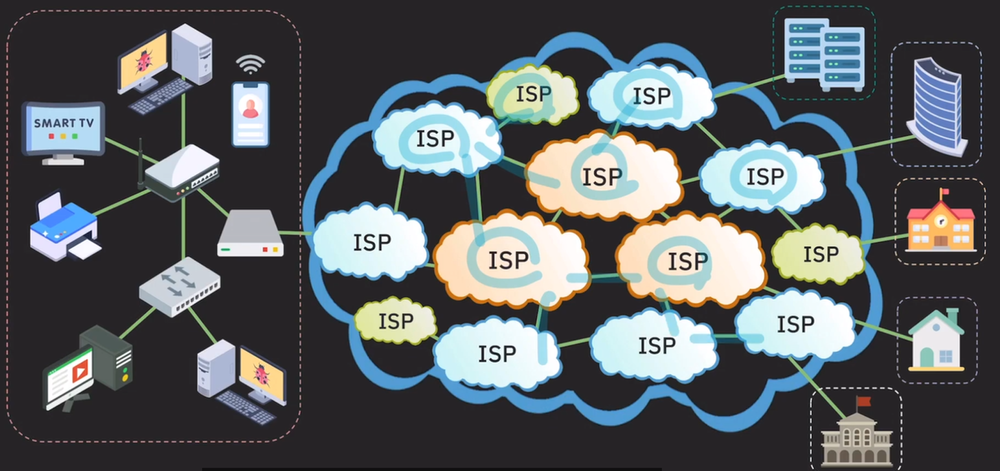

# 네트워크

[모뎀 - 아날로그/디지털 변환기](pages/모뎀.md)

[OSI 7 Layer](pages/OSI_7_layer.md)   
[OSI 4 Layer](pages/OSI_4_layer.md)   
[부호화와 복호화의 개념](pages/부호화_복호화.md)   
[네트워크 국제 표준안](pages/네트워크_국제_표준안.md)   
[용어 정리](pages/네트워크_용어정리.md)   

**네트워크란 네트워크 전체에서 어떻게 서로 다른 장치들이 데이터를 주고받고 소통하는지 이해하기 위해서입니다.**

즉 우리 개발자에게 네트워크에 대한 이해가 있어야, 클라이언트와 서버 간의 데이터 통신을 최적화하고, 발생할 수 있는 다양한 네트워크 문제를 해결할 수 있기 때문입니다. 이는 결국, 우리가 만드는 소프트웨어가 사용자에게 더 나은 경험을 제공하는 데 필수적입니다.

### LAN(local area network) - 가까운 곳 인터넷 연결 방법

인터넷(the netwokr or networks / the world’s largest WAN / global network) 연결되기 위해 IP 주소를 할당 받아야한다.

물리적으로 연결하기 위해서 케이블선과 모뎀을 연결해야한다.

모뎀에 공유기를 연결해야한다,

만약 공유기에 랜포트가 부족다면 스위치(허브)를 구매하면 된다.

    기술

    - Ethernet - 유선 통신
    - wireless LAN(wi-fi) - 무선 통신

### WAN(Wide area network) - 거리가 있는 곳 인터넷 연결 방법

어떻게 내가 가입한 ISP가 다른 컴퓨터와 통신할 수 있을까?

내가 특정 컴퓨터에 데이터를 전달하기 위해서는 내가 가입한 ISP에 데이터를 보내면 그 ISP가 다른 ISP로 ··· 최종적으로 원하는 서버에 데이터를 전달할 수 있다.

근데 ISP도 tier가 나뉜다.

1. tier 1 : 국제 범위의 네트워를 보유하고 있어서 인터넷의 모든 네트워크랑 연결이 가능하다. / 인터넷의 중추 역할을 한다.
2. tier 2 : 국가/지방 범위 네트워크 보유(skt, kt, lg 등) / tier 1 ISP에 비용을 내고 트래픽 전송
3. tier 3 : 작은 지역 범위 서비스 제공 / 상위 ISP에게 비용을 내고 인터넷 트래픽을 구매해서 서비스를 사용

    

**ISP 네트워크 간에는 어떻게 연결되는 걸까?**

내가 보낼라는 IP주소를 들고 라우터에게 물어보고 물어보고 물어봐서 간다.

---

---
### World Wide Web (web / www)
http에 대해서 이해를 하려면 웹이 무엇인지부터 알아야 합니다.   

- **정의** : 인터넷을 통해 전 세계 사람들이 정보를 공유하고 접근할 수 있게 해주는 거대한 정보 공간입니다. 흔히 "웹"이라고 부르는 WWW는 웹 페이지와 웹 사이트로 구성되어 있으며, 이들을 통해 텍스트, 이미지, 비디오 등 다양한 형태의 정보를 제공하고 교환할 수 있습니다.   
- **역할** : WWW는 정보를 하이퍼텍스트 형태로 조직화하여 사용자가 웹 브라우저를 통해 쉽게 접근하고 탐색할 수 있도록 합니다.

### Hypertext Transfer Protocol (HTTP)
- **정의** : HTTP는 웹 브라우저와 웹 서버 간에 데이터를 주고받는 통신 규약입니다. 즉, 웹 페이지를 요청하고 전달하는 방식을 정의한 프로토콜입니다.
- **역할** : 사용자가 웹 브라우저에서 웹 페이지를 요청할 때, 이 요청은 HTTP를 통해 웹 서버로 전송됩니다. 웹 서버는 요청된 웹 페이지를 HTTP를 통해 다시 브라우저로 전송합니다.

### 요약
- **WWW** : 웹 페이지들이 연결된 거대한 정보 공간
- **HTTP** : 이 웹 페이지들을 웹 브라우저와 서버 간에 주고받는 통신 규약
- **HTTP** : WWW가 작동할 수 있도록 도와주는 기반 기술입니다. WWW는 HTTP를 통해 웹 페이지들을 사용자에게 전달합니다.

---
## Socket, Port
### TCP/IP stack
4. application layer
3. transport layer
2. internet layer
1. link layer

**1-3 layer (SYSTEM)**
- 하드웨어/펌웨어, OS 레벨에서 구현/관리
- 네트워크 기능을 지원하는 목적

**4 layer (APPLICATION)**
- 애플리케이션 레벨에서 구현/관리
- 네트워크 기능(1-3) 기능을 사용하는데 목적

**PORT**
- process와 연결된 data path 혹은 data channel
- port name을 통해 식별

internet protocol
하나의 호스트에서 다른 호스트에 데이터를 보내는데 완벽히 보내주지는 않는다. (신뢰할 수 없음)
근데 그 위에(transport layer) 프로세스 간의 통신에서는 데이터를 안정적으로 주고 받을 수 있는 프로토콜이 필요하고 그게 TCP이다.

### Socket (internet address + port number)
인터넷 상에 존재하는 각 port를 유니크하게 식별하기 위한 주소

