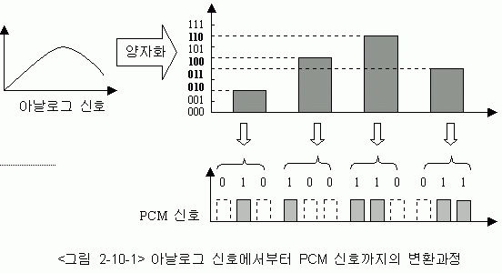

# 부호화 - 데이터를 전송 가능한 형태로 변환하는 과정
보통 디지털 데이터를 전송하기 위해 아날로그 신호로 변환합니다.    
이를 통해 데이터는 네트워크를 통해 전송되며, 수신 측에서 다시 원래의 데이터로 **복호화(Decoding)** 가 됩니다.

## 아날로그와 디지털 변환
### PCM (펄스 부호 변조, Pulse Code Modulation)
- 디지털 데이터를 전송하기 위해 `아날로그 신호를 디지털 신호로 변환`하는 방법입니다.   
- 이 과정에서는 아날로그 신호를 일정한 시간 간격으로 샘플링하고, 그 샘플들을 디지털 값으로 변환하여 전송합니다.   
- 예를 들어, 음성 데이터를 전송할 때, PCM 방식이 자주 사용됩니다.   

    

 

### ASK, FSK, PSK (진폭, 주파수, 위상 변조)
아날로그 신호를 디지털 신호로 변환하는 방식에서 변조 기술들이 사용됩니다.   
- **ASK**: 진폭 변조 방식으로, 디지털 데이터를 전송할 때 신호의 진폭을 변조합니다.
- **FSK**: 주파수 변조 방식으로, 주파수를 변조하여 데이터를 전송합니다.
- **PSK**: 위상 변조 방식으로, 위상을 변조하여 데이터를 전송합니다.

 

### 오류 검출 및 수정 부호화
- 데이터를 전송하는 동안 발생할 수 있는 오류를 탐지하고 수정하기 위해 사용됩니다.
- **패리티 비트(Parity Bit)**: 데이터를 전송할 때, 데이터의 비트 수가 짝수인지 홀수인지를 확인하는 추가 비트를 붙입니다. 이 방법으로 간단한 오류를 감지할 수 있습니다.
- **해밍 코드(Hamming Code)**: 더 복잡한 오류 검출 및 수정 기능을 제공하며, 데이터 전송 중 발생한 오류를 감지하고 스스로 수정할 수 있습니다.
- **CRC (순환 중복 검사, Cyclic Redundancy Check)**: 데이터가 전송된 후 데이터의 무결성을 확인하기 위해 사용됩니다. 송신자가 데이터의 CRC 값을 계산해 보내면, 수신자가 받은 데이터의 CRC 값을 비교해 오류 여부를 확인합니다.

---
### ASK, FSK, PSK vs AM, FM, PM

### 결론
- ASK, FSK, PSK는 디지털 데이터를 전송할 때 사용되는 변조 방식입니다.
- AM, FM, PM은 아날로그 신호를 전송할 때 사용되는 변조 방식입니다.

### 상세 내용
1. **디지털 변조 (ASK, FSK, PSK)**:   
   - **ASK (Amplitude Shift Keying):** 디지털 데이터에 따라 신호의 진폭을 변경하는 방식입니다.
     - '1'일 때는 큰 진폭, '0'일 때는 작은 진폭을 사용합니다.
   - **FSK (Frequency Shift Keying)**: 디지털 데이터에 따라 신호의 주파수를 변경하는 방식입니다.
     - '1'일 때는 높은 주파수, '0'일 때는 낮은 주파수를 사용합니다.
   - **PSK (Phase Shift Keying)**: 디지털 데이터에 따라 신호의 위상을 변경하는 방식입니다.
     - '1'일 때는 일정한 위상, '0'일 때는 다른 위상을 사용합니다.
   - **사용처**: 디지털 변조는 주로 네트워크, 모뎀, Wi-Fi 등 디지털 통신에 사용됩니다.
2. **아날로그 변조 (AM, FM, PM)**:
   - **AM (Amplitude Modulation)**: 아날로그 신호의 진폭을 변경하는 방식입니다.
     - 원래의 신호(소리나 영상)를 다른 진폭 크기로 변환하여 전송합니다.
   - **FM (Frequency Modulation)**: 아날로그 신호의 주파수를 변경하는 방식입니다.
     - 신호의 주파수를 연속적으로 변환해 전송합니다. 라디오 방송에서 많이 사용됩니다.
   - **PM (Phase Modulation)**: 아날로그 신호의 위상을 변경하는 방식입니다.
     - PM은 FM과 밀접한 관계를 가지며, 위상을 변조하여 신호를 전달하는 방식입니다.
     사용처: AM, FM, PM은 라디오 방송, TV 방송, 아날로그 신호 전송 등에 사용됩니다.