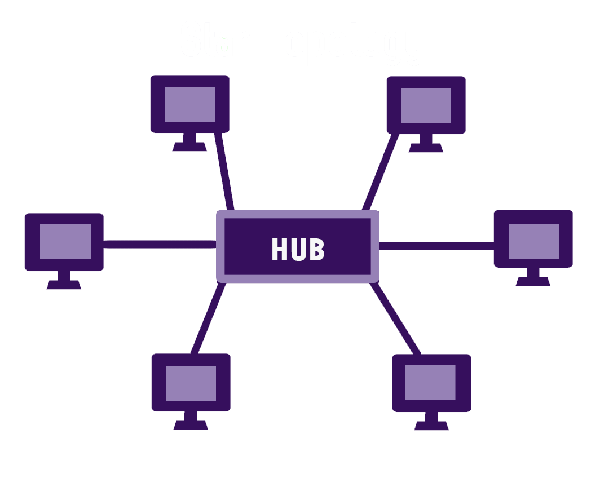
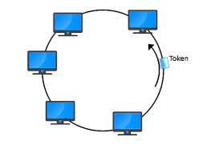
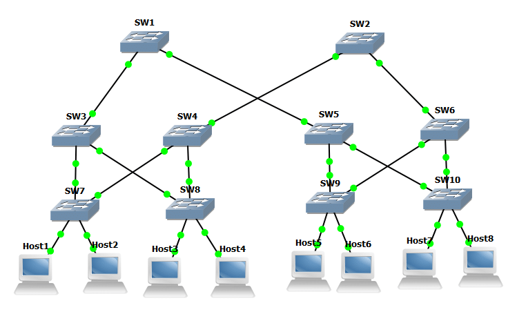
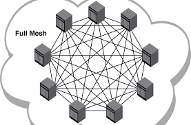

# 네트워크 토폴로지

| 네트워크를 배치하는 방법으로, **링크와 노드들이 어떤 식으로 배치되어 서로 연결되는지를 물리적 혹은 논리적으로 설명**합니다.

네트워크가 배치되는 방법은 매우 다양하며, 모두 나름의 장단점이 있는데 본인의 업무에 가장 적합한 네트워크 토폴로지를 만들고 관리하기 위한 핵심 사항은 목표와 필요조건을 확실히 파악해야 한다는 것입니다.

 

---
### 네트워크를 하나의 도시라고 생각하면 토폴로지는 도로를 표시한 지도입니다.
---

 

- **물리적 토폴로지** : 노드와 전선, 케이블 등등 네트워크 사이의 물리적 연결 및 상호 연관
- **논리적 토폴로지** : 네트워크 배치의 방식과 이유, 데이터가 네트워크를 통해 어떻게 흐르는가의 개념

 

## 5가지의 토폴로지
### 1. 스타 토폴로지 
중앙 서버 노드는 여러 클라이언트 네트워크 디바이스에 연결됩니다. 이 토폴로지는 데이터가 각 노드를 통과할 필요가 없기 때문에 성능이 더 뛰어납니다. 안정성도 더 뛰어납니다. 또한, 중앙 노드는 신호를 수신하여 재전송시키는 리피터처럼 기능하여 데이터 손실을 막아줍니다.

### 2. 버스 토폴로지 
각 노드는 하나의 다른 노드에만 연결됩니다. 네트워크 연결을 통한 데이터 전송은 한 방향으로 이루어집니다.

### 3. 링 토폴로지 
링 토폴로지에서 노드들은 원 또는 고리 모양으로 배열되어 있습니다. 데이터가 원 모양의 네트워크를 따라 한 방향 또는 양방향으로 흐르며 각각의 장치 양옆에는 두 개의 이웃 노드가 꼭 존재합니다. 그러나 단일 노드 장애로 인해 전체 네트워크가 중단될 수 있습니다.

### 4. 트리 토폴로지 
트리 토폴로지 구조는 네트워크에서 나무줄기처럼 기능하는 중앙 노드와 가지처럼 바깥으로 뻗어 나가는 노드들의 모양에서 그 이름을 따왔습니다. 스타 토폴로지에서는 각각의 노드가 중앙 허브에 직접 연결되었지만, 트리 토폴로지에서 노드들은 부모-자식 계층 구조로 연결되어 있습니다. 중앙 허브에 연결된 노드는 다른 노드와 선으로 연결되어 있어, 연결된 두 개의 노드는 하나의 연결만을 상호 공유합니다. 트리 토폴로지 구조는 극히 유연하고 네트워크 확장이 매우 쉽기 때문에, 광역 통신망에 사용되어 넓게 퍼진 장치들을 지원합니다.

### 5. 메시 토폴로지 
모든 노드는 다른 많은 노드에 연결됩니다. 풀 메시 토폴로지에서 모든 노드는 네트워크의 다른 모든 노드에 연결됩니다.

 
 

https://www.edrawsoft.com/kr/for-beginners/what-is-network-topology.html

