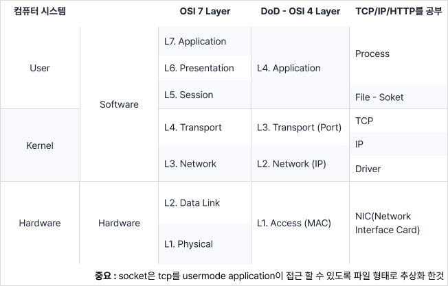
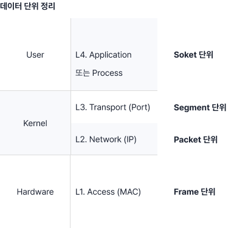
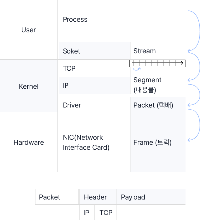
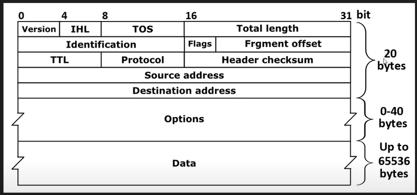
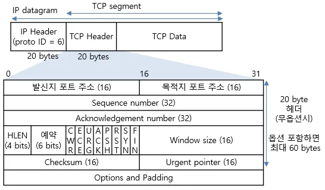

# 1
네트워크는 이렇게 공부해야한다.

무엇가를 알고 싶으면 그것에 대한 실체에 대해 먼저 공부를 하라고 한다. 
내가 어떤 사람과 친해지고 싶으면 그 사람에 대해 알아야지 인간에 대한 공부부터 하면 안 되는데 이 강사는 이때 '사람'을 OSI 7 Layer라고 말한다. 

TCP/IP + HTTP는 구현이고 OSI 7 Layer는 개념적 표현들이다.

컴퓨터의 세계는 세 개의 레이어로 구성되어 있다.

<br>

---
## 소프트웨어(SoftWare)
### 1. User(운영체제 수준)   
### 2. Kernel   
## 3. 하드웨어(HardWare)
---





> 소켓 : TCP/IP를 유저 모델 어플리케이션에 접근할 수 있도록 파일 형식으로 추상화한 인터페이스


<br>


# 2
MAC주소, IP주소, Port번호가 식별하는 것

- **MAC** : 하드웨어 주소 / NIC(LAN 카드)에 대한 식별자
  - 하드웨어 주소 + 변경 가능
- **IP주소 (v4, v6)** : Host에 대한 식별자 (네트워크에 연결됐다.)
- - Host : 인터넷(네트워크)에 연결된 컴퓨터
  - NIC에 IP 바인딩을 N개 할 수 있다.
- Port 번호 : 업무에 따라 Port 번호는 정의가 달라진다.
  - process 식별자 / service 번호 / interface 번호
    - service : 네트워크에서 정의된 특정 기능 수행을 의미한다. 웹 서비스의 경우 http 서비스 식별자가 사용된다.
    - interface : LAN 케이블 단자는 컴퓨터가 속한 네트워크와 연결되는 장치와 연결하기 때문에 인터페이스라고 부르기도 한다.


<br>


# 3
Host, Switch, Network 이들의 관계에 대하여.

다시 한번 복습해보자
- **Host** : 네트워크에 컴퓨터가 연결된 컴퓨터
  - 네트워크 자체의 Host : Switch
  - 네트워크를 이용하는 Host : End-Point(단말)
- **Swich** : 네트워크 자체를 이루는 컴퓨터 (Router)
  - **End-Point** : 네트워크 이용주체 (Pear, Client, Server)
- **Network** : Internet
   - Internet : 라우터와 DNS의 집합체이다.


<br>


# 4
IPv4주소 체계에 대한 암기사항


IP주소와 Net-mast(서브넷 마스크)
    - IP주소 : Host에 대한 식별자

Network, Host, IP의 구별방법
- 대한민국에서 개인을 주민등록번호로 식별할 수 있다.
- = Network에서 Host를 IP로 식별할 수 있다.


- IP (Internet Protocol)
  - Internet : 복수의 통신망을 집합시킨 광역 통신망
  - Protocol : 규약, 규칙
- IP 주소
  - IPv4 : 32 bit 주소체계 = 43억개
  - IPv6 : 128 bit 주소체계
- 
    예시. 192.168.60.14 = 8bit.8bit.8bit.8bit = 32bit

    <details>
    <summary>2진수를 4비트씩 나눠서 16진수로 표현하기</summary>
    <div markdown="1">
        <ul>
            <li>1111(2) = 10(15) = F(16)</li>
            <li>(15 * 16) + (15 * 1) = 255</li>
            <li>만약 FFF라면 (15 * 16^2) + (15 * 16) + (15 * 1) = 4,095이다.</li>
        </ul>
    </div>
    </details>

<!-- 0~255 = 2^8 = 0000 0000 ~ 1111 1111 -->
        

IP를 나눴을 때 Class A/B/C Network를 바탕으로 어느 쪽은 네트워크 ID, 어느쪽은 호스트 ID가 된다. 즉 Net ID + Host ID.

<details>
    <summary>만약 Net ID가 24 bit일 때 Host ID는?</summary>
    <div markdown="1">
        <ul>
            <li>정답은 8 bit이다. </li>
            <li>왜냐 IPv4의 길이는 32 bit이기 때문이다.</li>
            <li>32bit(IP) - 24bit(Net ID) = 8bit(Host ID)</li>
        </ul>
    </div>
</details>


서브넷 마스크
IP 주소에서 Network ID의 길이를 알아내는 게 Subnet Mask이다. 서브넷 마스크는 기본적으로 자체 32비트 숫자를 이용하여 IP 주소를 마스킹하기 때문에 여기서 ‘마스크’라는 단어가 이용

> 서브넷 마스크는 IP 주소를 네트워크와 호스트로 나누는 기준 + 서로 같은 네트워크에 있는지 판단 + 서브넷마스크 없이는 IP 주소만 보고 네트워크 구조를 구분할 수 없다.

- 네트워크가 어디까지고, 호스트가 어디부터인지 구분을 하여 특정 네트워크 내에서만 통신이 이루어지도록 제한한다.
- 아!!! 네트워크로 여기까지 사용하고 있다. 즉 255.255.255.0은 8bit.8bit.8bit.0bit를 쓰고 있어서 24bit를 사용 중이다!
- 다른 예시
  - 192.168.123.132를 예로 들면 이 IP 주소에서 ‘192.168.123.’은 네트워크를 나타내며 ‘132’는 네트워크에 연결된 기기를 나타냅니다.
  - 네트워크 IP : 192.168.123.132 = 11000000.10101000.01111011.10000100
  - 호스트 IP : 255.255.255.0 = 11111111.11111111.11111111.00000000
  - 이 둘을 합치면 다음과 같다.
    - 11000000.10101000.01111011.00000000 (네트워크 주소: 192.168.123.0)
    - 00000000.00000000.00000000.10000100 (호스트 주소: 000.000.000.132)

서브넷
전 세계에 수백만 개의 네트워크가 존재하는데, 네트워크가 작은 조각으로 쪼개져 있는 경우 이런 조각을 서브넷이라고 합니다.

서브네팅
이러한 서브넷을 효율적으로 자원을 배분하는 것이다.


예시. IP 주소가 192.168.60.14이고 서브넷 마스크가 255.255.255.0이었다. // 여기서 비트 연산이 사용된다.
1. 192는 0xC0 == 1100 0000, 255는 0xFF == 1111 1111이다
     1100 0000
     1111 1111 이 두개를 AND 연산으로 bit 연산을 한다면
2. 1100 0000 으로 이 값은 192 그대로인데 
3. 14는 255와 AND 연산을 했을 때 0이 나온다.
4. 즉 둘을 비트연산을 하면 192.168.60.0이 되고 이게 네트워크 ID가 된다.


> 이걸 표기할 때 192.168.60.14(호스트 ID)/24(네트워크 ID)이고 이걸 용어로 표가헐 수도 있다/=.

<details>
    <summary>IPv4 주소가 172.30.1.63이고 서브넷 마스크가 255.255.255.0일 때 표기법은?</summary>
    <div markdown="1">
        <ul>
            <li>정답은 172.30.1.0/24 </li>
            <li>이유는 255.255.255 = 24비트 (Ne)</li>
        </ul>
    </div>
</details>


<br>


# 5
개발자 입장에서 Port번호 이해하기

Port 번호는 세 가지 의미로 해석될 수 있다.
- Process 식별자
- Service 식별자
- InterPace 번호


유저 모드   프로그램을 실행하면 프로세스
           TCP/IP가 유저 모드 어플리케이션이 접근할 수 있도록 인터페이스가 제공. 본질은 File이지만 Socket이라고 한다.
           이떄 TCP Socket일 경우 소켓의 정보 중 하나가 Port 번호이다.
           Port 번호는 16bit 정보이다. 경우의 수 = 2^16 -> 0 ~ 65,535인데 0과, 65,535빼고 사용한다.
커널 모드   TCP/IP + Driver

하드웨어    NIC


(하드웨어)              (커널모드)                      (유저모드)
어떤 컴퓨터가 있는데 그 컴퓨터의 IP가 192.168.0.10이고 프로그램이 2개(엣지, 크롬)가 실행이 된다.
이때 프로세스(실행된 프로그램) 엣지의 포트가 8080이라면 크롬의 포트는 8080이 될 수 없다.
즉 개발자의 입장에서는 Process 식별자가 되는 것이다.


> 프로토콜 분석하는 프로그램을 직접 개발해보면 쉽게 이해할 수 있다.


<br>


# 6
Switch가 하는 일은 Switching 이다.

| Network는 고속도로이다.
1. 교차로(Swich) 중에 경로&인터페이스를 선택하는 것이 Switching이다.
2. 최적화된 경로로 가기 위해서 이정표(라우팅 테이블)가 필요하다.


<br>


# 7
네트워크 데이터 단위 정리 (매우 중요!)



- User 모드 Application/Process 수준 = 즉, Socket 수준 = Stream 데이터
  - `Steam` 데이터는 그 끝을 알 수 없는 데이터이다. 
  - 그걸 네트워크로 보내기 위해서 분해(자르기)가 필요 = Segment
- 잘려진 조각 하나를 `Segment`라고 하는데 그걸 박스로 포장한 것을 `Packet`이라고 한다.
  - `Packet`의 최대 크기는 1500bytes이다.
- 이 Packet을 실어나르기 위해서는 다시 `Frame`에 넣는다.


<br>

# 8
네트워크 인터페이스 선택 원리와 기준
| **인터페이스 선택의 핵심 원리!**

- PC의 경우 메트릭 값(비용)이 기준이 된다.


<br>

# 9 
웹 서비스를 만드신 분에 대하여

## WEB 탄생의 배경
- '티모시 버너스 리'는 입자물리연구소의 연구원이었다.
- 문서에서 효율적인 검색을 하고 싶었다.
- 문서에서 다른 문서로 이동하고 싶었다. 
- `HTML` 문서 형식이 생겼다.
- HTML을 인터넷(연결)에 제대로 전달할 수 있는 방법을 고민했다. `HTTP 프로토콜`
- 문서들이 마치 거미줄처럼 보여서 모두 싸잡아서 `Web`이라고 부르게 되었다.


<br>

# 10
웹 서비스 구조

- Web = HTML + HTTP
- 프로그램은 보통 세 가지로 이루어져있다.(유지보수 편의성을 위하여.)
  - 자료구조
  - 인터페이스(UI) 
  - 이 모든 것에 대한 제어체계


- 클라이언트 브라우저를 이루는 세 가지 요소
  1. 구문 분석할 수 있는 Parser -> 자료구조(비선형) DOM
  2. 렌더링 엔진
  3. 연산 주체가 되는 JavaScript
- 클라이언트와 서버의 기록 
  - 서버는 `DataBase`로 기억한다. 
  - 클라이언트는 쿠키(`Cookie`)로 기억한다.


WAS, JVM 그리고 RESTful API
WAS
웹 서버를 이루는 요소는 세 가지가 있다.
1. Web Server (송수신)
2. OOO (처리(연산)) = WAS(Web Application Server)
   - 여기서 분야별로 쪼갠 비즈니스 로직이 `MVC`이다.
3. Database (자료)


JVM
- CPU가 Machine이라고 하는데 Java는 H/W에 있는 Machine을 S/W에 구현했다. 
- 그래서 JVM(java virtual machine)가 생겼다. == CPU 고 이것을 작동하기 위해선 `java byte code`다.
- 작업을 하다보면 JVM에서 작동할 수 있는 모듈들이 많아질텐데 이것들을 또 다른 소프트웨어가 존재한다면 가운데에서 잘 작동할 수 있도록 만들어주고 이건 S/W를 위한 S/W인 `Middleware`라고 한다.
  - ex. WAS
- 근데 Middleware를 막 짜면 안되니까 그 사이에 `Framework`를 집어넣어서 이 Framework를 통해서 개발이 이루어지도록 한다.
  - ex. Spring, Spring boot, JSP, PHP, ASP, Node.js가 있다.
  - 그래서 웹 개발하는데 서버 개발이나 백엔드 개발을 한다고 하면 이 Middleware(WAS)를 개발하는 거다.


- 구성요소를 보니까 세 가지가 있는 게 보였다. (1) Web Server, (2) WAS, (3) Database. = Tier
- 이 Tier를 셋으로 쪼개다보니 `3-Tier Web Solution`이라고 부르게 되었다.


- 성능을 논하는 것은 크게 두 가지 `(1) 응답속도, (2) Java byte code`가 있는데 이 두가지를 모니터링하는 솔루션이 있는데 `APM(Application Perfomance Management System)
  - 예시. Scouter APM, Jennifer


RESTful API
- UI가 계속 발전하다보니 HTML 전체로 화면을 꾸리기에 어려움을 느꼈음
- 이때부터 Client와 Server는 데이터만 보내기로 했음. EX) JSON
- 뷰는 데이터를 주고 받으며 스스로 HTML을 만들기로 했고 이걸 javascript가 생성함
- javascript로만 하기에는 코드가 너무 길어져서 이에 필요한 Framework가 생겨났음 EX) React.js, Vue.js


보안
- 웹서버와 인터넷망이 붙을 때 항상 세 가지 요소가 들어간다.
  1. IPS (침입 방지 시스템)
  2. SSL (암호화 처리)
  3. Web Application Firehole


<br>

# 11
LAN과 WAN을 구별하는 방법

| 다른 강의랑 약간 다르게 설명하지만 맥락은 똑같은 것 같다.

### LAN
- 물리적(Physica)으로 설명되는 네트워크
- MAC Address가 중요한 네트워크
- 방송주소(BroadCast)가 도달하는 범위

### WAN
- 인터넷 네트워크는 IP주소로 분류한다.
- 인터넷 네트워크는 Virtual Network이다.


<br>

# 12
패킷의 생성 원리와 캡슐화

| Socket : TCP라는 요소를 유저모드 어플리케이션 Process가 접근할 수 있도록 추상화한 인터페이스

- Segment : 내용물 - Packet : 택배(Header(송장) + Payload(내용물)) - Frame : 트럭




<br>

# 13
L2 스위치

- L2 switch는 MAC Address(48bit)로 스위치한다.
  - ipconfig에서 나오는 물리적 주소가 MAC의 주소이다.


- 이용주체(EndPoint)가 네트워크에 처음 만날 때 가장 먼저 만나는 스위치가 `L2 Access Switch`이다.
  - 마치 하나의 방 같은 느낌이다.
- `L2 Distribution`은 보통 Switch를 위한 Switch이다.
  - 방들의 묶음인 건물 한 층같은 느낌이다.
  - 이후 Gateway(Router)(건물)로 이동을 하고 인터넷으로 연결이 된다.

| 지금 기억해야할 것
1. L2 Switch가 크게 두 종류가 있다.
2. EndPoint와 직접 마주하는 L2 Access Switch
3. L2 Access를 위한 Switch인 L2 Distribution Switch

  ```
  - Uplink : Lan이 상향 연결
  - Link-up : 연결(녹색)
  - Link-down : 연결 해제
  ```


<br>

# 14
IP 헤더 형식과 의미 요약

## IP 헤더 형식(IP Header Format)과 의미 요약
- Packet : 택배 - 1500 MTU
  - Header
    - TCP/IP : 20 byte/20 byte
  - Payload
    - MSS(Maximem Segment size) : 1460




### 어려우니까 일단 쉽게 택배 상자에 비유해보자
- **`version - 택배 상자의 버전`**
  - 요즘은 IPv4라는 상자를 주로 쓰고 있지만, 더 커다란 IPv6라는 상자도 도입 중이야.
- **`IHL - 상자의 설명서 길이`**
  - 이 IHL은 그 설명서(즉, 헤더)의 길이를 나타내는 거야. 기본적으로 설명서는 20 바이트(약간의 정보들로 구성된 기본 설명서 크기)지만, 더 많은 설명이 필요하면 늘어날 수 있어.
- **`TOS - 우체국에서 다루는 우선순위`**
  - TOS는 우체국에서 이 택배를 얼마나 빨리 처리해야 할지 정해주는 라벨 같은 거야. "이건 급해요!" 또는 "그냥 천천히 와도 돼요!" 같은 정보라고 보면 돼.
- **`Total Length - 택배 상자의 크기`**
  - 택배 상자 전체가 얼마나 큰지 알려주는 정보라고 보면 돼. 상자와 그 안에 든 내용물의 크기를 합한 총 크기지.
- **`Identification - 택배의 ID 번호`**
  - 택배 상자마다 고유의 ID 번호가 있어. 만약 네트워크가 복잡해서 이 상자를 여러 개로 쪼개서 보냈다면, ID를 보고 다시 원래 상자로 재조립할 수 있어.
- **`Flags - 상자를 쪼갤 수 있는지 여부`**
  - 택배 상자를 여러 조각으로 나눌 수 있는지 결정하는 플래그야. "이 상자는 나눠도 돼요!" 혹은 "이 상자는 절대로 나누지 마세요!"라고 표시해두는 거지.
- **`Frgment offset - 상자의 조각 위치`**
  - 상자가 여러 조각으로 나눠졌을 때, 각 조각이 원래 상자의 어디쯤에 있었는지 알려줘. 이 정보 덕분에 다시 조립할 때 순서를 헷갈리지 않을 수 있어!
- **`TTL (Time to live) - 상자의 유통기한`**
  - 상자의 유통기한이야. 네트워크를 돌아다니면서 정해진 TTL 시간이 다 되면, 상자는 더 이상 이동하지 못하고 버려져. 이건 상자가 길을 잃고 계속 맴돌면서 네트워크에 혼잡을 일으키지 않게 하려는 거야.
- **`Protocol - 상자 속에 뭐가 들었는지`**
  - 상자 속에 담긴 물건이 어떤 종류인지 알려줘. 이건 프로토콜이라고 하는데, 예를 들어 TCP나 UDP 같은 게 있어. 마치 상자에 "깨지기 쉬운 물건" 혹은 "문서"라고 라벨을 붙이는 것처럼, 네트워크가 그 안의 데이터를 어떻게 처리해야 하는지 알려주는 거지.
- **`Header checksum - 상자에 이상이 있는지 검사하는 장치`**
  - 상자가 이동 중에 망가지지 않았는지 확인하는 방법이야. 만약 잘못되었다면 바로 폐기되거나 재전송 요청을 할 수 있어.
- **`Source address - 보내는 사람의 주소`**
  - 여기엔 보낸 사람의 IP 주소가 적혀 있어.
- **`Destination Address - 받는 사람의 주소`**
  - 당연히 택배가 정확한 목적지로 가려면 받는 사람의 주소가 적혀 있어야겠지.
- **`Options - 택배를 보낼 때 붙이는 추가 요청`**
  - 추가로 특별한 요청이 있을 때 여기에 적어. 예를 들면 "배달 완료 후 사진 찍어주세요" 같은 요청사항을 적는 공간이야.
- **`Data - 상자 속의 물건 `**
  - 상자 안에 진짜로 들어있는 물건이야. 네가 진짜로 전달하고 싶은 데이터를 담고 있는 부분이지!


네트워크를 공부하다보면 반드시 사용하게 될 Wireshark 프로그램이 있다.


<br>

# 15
커널과 사용자 모드 간의 네트워크 패킷 분석: 와이어샤크와 Npcap

## H/W - Kernel - User 형태로 통신
- **NIC**은 실제 네트워크 데이터(패킷)를 전송하고 받는 하드웨어 장치입니다.
- **TCP/IP 스택**은 운영체제의 **커널(Kernel)**에서 동작하며, NIC과 상호작용하여 데이터를 처리합니다. 즉, 하드웨어(NIC)에서 패킷을 받으면 커널이 TCP/IP 스택을 통해 해당 패킷을 처리하고, 이를 유저 모드 애플리케이션에 전달합니다.
- **User Mode**는 사용자 애플리케이션이 있는 공간으로, 여기서 우리가 사용하는 프로그램들이 동작합니다. `와이어샤크`와 같은 네트워크 분석 도구도 여기에 속합니다.


## Fiter와 Sensor의 차이
- **Filter** : 필터는 커널 내에서 동작하여 특정 조건에 맞는 패킷만 잡아내는 역할을 합니다. 예를 들어, 방화벽(filewall)은 필터링 역할을 하여 허용된 패킷만 통과시키고 나머지는 차단합니다.
  - **ByPass** : 필터를 통과
  - **Drop** : 필터링이 된다. 
- **Sensor** : 센서는 필터처럼 데이터를 차단하지 않고, 데이터를 "감지"하고 수집하는 역할을 합니다. 여기서 와이어샤크는 패킷을 수집하는 **Sensor** 역할을 합니다. 즉, 네트워크 상에서 오가는 모든 패킷을 읽어오지만, 실제 통신 흐름에 영향을 주지 않습니다.


<br>

# 16
Router의 내부 구조와 Inline (어렵다)

네트워크 장치가 있고 그 장치를 이해할라면 세 가지를 구분할 줄 알아야한다. 
1. 인라인 디바이스인가요?
2. 인라인 방식으로 설치하면 되나요?
3. 이 장치는 Out of path 구조로 설치하면 되나요?

네트워크는 주로 inline device이다.

- **방화벽과 라우터** : 방화벽과 라우터는 둘 다 L3 스위치에 속하고, IP로 통신을 합니다. 
- **Inline** : 내부적으로 라우터는 ByPass or Drop을 결정하고 어디로 패킷을 보낼지를 지정해줍니다.


> 아주 쉽게 방화벽은 기본적으로 라우팅 기능을 일부 가지고 있다. 다른 말로 '보안 스위치'라고도 부른다.


# 20~24 Proxy 파트 아직 안 들었음
## Proxy의 구조
(Application) Proxy(대리자)

지번에 배운 것 : Inline + Out of path

1. 기본 : PC #1 3.3.3.3이 Internet을 타고 Naver 5.5.5.5에 접속을 하는 방법
2. 프록시 : PC#1 3.3.3.3이 Internet을 타고 PC#2 9.9.9.9(Proxy)에 들렸다가 Proxy가 Naver 5.5.5.5에 접속을 하는 방법

- Application Proxy : Proxy 역할을 하는 프로세스

이렇게 기억하고 있되, 살고 있는 계층이 다르다.
- User mode Application Proxy = Socket, Stream
- Inline Out of Path = Packet


## Proxy를 사용하는 이유
### 클라이언트 보호
1. 우회
   - HTTP(Web)을 접속할 때 내 컴퓨터인 3.3.3.3에서 접속하는데 프록시 9.9.9.9를 타고 5.5.5.5으로 가면 5.5.5.5에서는 9.9.9.9에서 접속한 걸로 확인된다. 
   - 주의할 점
     - Proxy를 사용했을 때 다른 나라의 IP로 변경할 수 있으나 Proxy에서는 모든 통신을 감청할 수 있다.
     - 우회 관련해서는 VPN에서 더 설명하는데, VPN은 Network / Proxy는 HTTP 수준에서 쓰인다.
   - Proxy 관련한 Tor Project : 인터넷에게 자유를게.
2. 분석
  - 웹은 기본적으로 HTTP 통신을 하는데 HTTP는 평문(암호화 하지 않은) 통신이기 때문에 내 정보가 다 돌아다닌다. 그래서 SSL 적용을 통해 소켓에 암호화를 하여 HTTPS를 사용한다. (트래픽이 보이지 않는다.)
    - 와이어샤크로 Packet에 Header와 Payload 사이를 분석하려고 하니 SSL으로 인하여 암호화가 되었다. 즉 암호가 해석하기 전까지 알 수가 없다. 이런 연유로 Proxy 서버를 Stream에 알려주면 크롬이 Proxy를 Local로 설정했으니 Proxy socket에 접속하고 나간다. 
    - Fiddler라는 도구를 통해 Socket 통신을 스스로 분석할 수 있다.
3. 감시와 보호
   - 특정 IP로 접속을 할 때 그 페이지에 악성코드가 있다. 그런데 우리는 Proxy를 사용하고 있어서 악성코드가 다시 내 컴퓨터로 오기 전에 Proxy에 들리게 되고 그럼 Proxy 서버에서 악성코드가 발견이 된다.


## Reverse Proxy
### 서버 보호
Client 측이 아니라 Server 측에서도 Proxy 구조가 존재합니다.

- 쉽게 설명해서 Hacker가 Google Server에 접속하려고 하는데 사실 Google의 IP가 Proxy IP였다.
- 그럼 Proxy에서 이 접속이 공격인지 접속인지 식별을 하고 공격이면 차단한다.
- 이 또한 감시 + 보호하고 감시하는 트래픽의 단위는 소켓(스트림)을 감시한다.
  - HTTP 통신 = L7 = Socket = Stream

<br>


# TCP 연결, LAN선 뽑기 그리고 게임해킹
L1~L2에서 생기는 충돌을 어어떻게 L4 이상에서 처리할 것인가.

TCP 연결의 성립이라는 의미는 Link-up / Virtual Circle이 되었다는 것이다.

다운로드 중에 LAN선을 뽑아보면 TCP 연결은 어떻게 될 것인가?
- 이것을 무선에서 Net 충격이라고 말한
- 유선에서는 영상을 보다가 이동 중에 기지국을 갈아타는데 이때는 TCP가 유지가 된다 = Virtual이기 때문에 논리적이게 유지
- 결론은 일정 시간동안에는 유지가 된다.


MMOMPG = 다중,동시,동기화 등)
- A 게임 (Server)
  - A 인원 (Client)
  - B 인원 (Client)
  - C 인원 (Client)

LAN선을 뽑으면서 아이템 복사가 되던 시절이 있었다.


<br>

# 이해하면 인생이 바뀌는 TCP 송/수신 원리
이해하면 인생이 바뀌는 TCP 송/수신 원리

| -- TCP/IP 연결 -- | 3-way-handshake
PC - L2 Router - Internet - Router - Server


- HDD에서 Memory(Buffer#1)으로 Read 
- Buffer#2로 이동
- Buffer#2에서 하나를 자르면 Segment이고
- Segment를 Packet이라는 박스에 집어넣는다.
- 그럼 그 패킷 하나가 인터넷을 통해 상대방에게 전달하는데,
- 그 전에 택배 기사님께 택배를 주면 트럭에 넣어요. (L2- Frame)
- 그렇다면 택배의 목적지는? 라우터 - 라우터 - 라우터를 찍어서 간다.
- 그렇게 택배가 도착했는데 거기에도 NIC - Driver - TCP/IP 프로토콜 - 소켓(파일) - 프로세서(클라이언트)
- 파일에 연결된 버퍼가 있고, TCP도 버퍼를 가지고 있다.
- 택배 기사가 택배를 끄집어 내는데 (L2 -> L3) 디캡슐레이션(박스를 뜯어서 준다)
- 뜯어서 나온 Segment 1번이 튀어나오고 TCP 버퍼 1번이 도착한다.
- 대략 2개의 세그먼트가 오면 TCP가 택배가 잘 도착했다고 알린다. (ACK)
- 서버를 보내는 사람은 1번을 보내고 2번을 보내는 즉시 3번을 보내는 게 아니라 ACK가 올 때까지 Wait를 한다. ACK에서 잘 도착했다고 오면 3번을 보내는데 Wait 때문에 속도지연이 발생한다. (TCP가 UDP보다 느린 이유)
- TCP 버퍼에 window size, ACK에 window size가 포함되어 있다. 만약 size가 부족하면 보내지 않는다.
- 수신측의 window size가 MSS보다 크면 YES(Send), No(Wait)
- TCP에 있는 버퍼를 소켓(파일) 버퍼에 빨리 보내야하겠죠?
- 그럼 프로세서에서 RW(Receive, Send)를 하는데 속도(Receive)가 네트워크 수신보다 빨리야한다. 이게 수신 속도보다 느리면 Window size가 여유가 없어서 wait가 된다.


### 1. 데이터의 흐름 : HDD에서 네트워크로
서버에서 데이터를 HDD에서 읽어옵니다. 이 데이터를 처음에 Memory(Buffer #1)로 읽혀요. HDD에 있는 데이터를 메모리로 옮기는 과정입니다. 이 메모리에서 데이터는 다시 Buffer #2로 이동하고, 여기서 네트워크로 전송할 준비를 합니다.

### 2. Segment와 Packet : 데이터를 나누고 패킹하기
네트워크로 보낼 데이터를 한 번에 전송하지 않고, Segment라고 불리는 작은 조각으로 나눠요. 이 Segment는 우리가 데이터를 네트워크 상에서 전송할 수 있도록 작은 단위로 쪼갠 것이죠. 이렇게 쪼갠 Segment는 Packet이라는 네트워크에서 사용할 수 있는 '박스' 안에 담겨요. 이 Packet이 인터넷을 통해 상대방에게 전송됩니다.

### 3. 택배 : Layer2에서의 전송
이 Packet(택배)이 네트워크로 전송할 준비가 끝났다면, 이 택배(Packet)를 싣고 난 트럭(L2에서 사용되는 Frame이라는 단위)은 L2에서 라우터 -> 라우터 -> 라우터 등을 거쳐서 목적지로 이동해요.

### 4. 목적지에 도착 : 패킷의 수신 과정
택배가 목적지에 도착하면 이제 택배 상자를 열어야해요. 여기서 디캡슐레이션이라는 과정이 발생합니다. 택배 기사가 패킷을 뜯어서 그 안에 Segment를 꺼내요. 이 과정은 네트워크 계층(L3)에서 일어나요. 뜯은 후에는 TCP 버퍼로 데이터를 넣습니다.

### 5. ACK와 윈도우 사이즈 : 송신과 수신 조율
데이터가 도착했음을 확인하려면 송신자가 ACK(수신 확인) 신호를 받아야 해요. 예를 들어, 송신자가 첫 번째 세그먼트와 두번째 세그먼트를 보내고, 그에 대한 ACK가 도착할 때까지 기다려요. ACK가 도착해야지만 세 번째 세그먼트를 보낼 수 이썽요. 이렇게 데이터를 확인하면서 보내기 때문에 TCP는 속도 지연이 발생할 수 있고, UDP보다 느리게 동작해요.

또한 TCP는 송수신 간의 데이터를 얼마나 많이 한 번에 처리할 수 있을지 결정하는 윈도우 사이즈라는 값을 가지고 있어요. 이 값이 수신 측에서 충분하지 않으면 데이터를 더 보내지 않고 기다려야해요. 즉, 수신 측의 윈도우 사이즈가 네트워크 패킷의 최대 크기(MSS)보다 크다면 데이터를 계속 보낼 수 있고 그렇지 않으면 기다려야 해요.

### 6. 버퍼와 속도 : 네트워크의 흐름 조율
TCP 버퍼는 이 데이터 흐름을 관리해요. TCP 버퍼에서 데이터를 받으면 이를 소켓(파일) 버퍼로 빠르게 보내야 해요. 그리고 소켓 버퍼에서 프로세스가 이를 처리하죠. 하지만 이떄 중요한 점은, 수신 속도가 네트워크 전송 속도보다 빨리야 한다는 거예요. 만약 그렇제 읺으면 윈도우 사이즈에 여유가 없어져서 데이터 전송을 멈추고 기다리는 상황이 발생합니다.


# TCP 연결이라는 착각
- TCP는 보안성이 없다. 
  - 정보 보호의 3대요소 (기밀, 무결, 가용)가 없다.

- 3-way handshake (의 단위는 segment)
  - 기본적으로 sequence 번호 교환 + MSS
  - 정책을 교환하는 절차
  - 보안성이 없다.


<br>

## TCP
IP 규칙으로 통신하기에 부족하거나 불안정하던 단점들(패킷 순서가 이상하거나 패킷이 유실)을 커버해, **패킷 전송을 제어하는 신뢰성을 보증하는 프로토콜**입니다.

IP 규칙에 써있는대로 목적지까지 다다랐으면, TCP 규칙에 써있는대로 올바르게 도착했고 정확히 누구에게 전달되어야하는지 검증합니다. 그래서 은행 업무나 메일 같은 일은 반드시 수신자가 정보를 받아야하는 신뢰성 있는 통신이 필요할 때 사용됩니다.

### TCP Header

TCP Header는 기본 20 Byte (160 bit)로 이루어져 있고 Option이 추가되는 경우 60 Byte까지 증가할 수 있습니다.



1. Sourse/Destination Port Number (각 16bit)
   - `발신자와 목적지`의 IP주소와 포트 번호가 합쳐진 소켓 주소로 이루어져 있습니다.
2. Sequence Number (32bit)
   - 전달되는 `패킷에 순서 번호를 부여`해 목적지에 도달했을 때 중복 패킷이 발생하는 것을 방지하고, 패킷의 순서를 보장해 이를 통한 신뢰성 및 흐름제어 기능을 제공합니다.
3. Acknowledgement Number (32bit)
   - 송신 메시지가 정상 수신되었음을, 수신측에서 송신측으로부터 확인 응답하는 부분입니다. 
   - 수신하기를 기대하는 다음 바이트 번호(마지막 sequence Number + 1)를 송신합니다.
4. Header Length(4bit) + 예약(6bit) + Flag(6bit) + Window Size(16bit)
   - Header Length은 TCP 헤더의 크기를 나타내고, 옵션의 길이를 알려주는 역할을 수행합니다.
   - 예약 필드는 현재까지 사용된 적은 없지만 향후 확장성을 위해 사용될 수 있는 공간입니다.
   - Flag 필드는 TCP 세그먼트 전달과 관련되어 TCP 회선 및 데이터 관리 제어 기능을 하는 6개의 플래그가 있는 자리입니다.
     - TCP Control Flag은 추후에 공부
   - WindowSize는 TCP 흐름 제어를 위해 송신자에게 수신자의 버퍼 여유 용량 크기를 지속적으로 통보하는 필드입니다.
5. Checksum/Urgent Pointer (각 16bit)
   - Checksum은 무결성 보호를 위한 TCP 또는 UDP의 실제 헤더와 발신, 수신 IP 주소 및 프로토콜 ID를 추가한 가상 헤더를 더한 전체 패킷에 대한 체크섬을 계산한다.

### TCP Control Flag
2. ACK
   - Acknowledgement Number 필드에 값이 세팅되었음을 알리는 역할입니다.
   - 1로 셋팅되면 확인번호가 유훃ㅁ을, 0이라면 확인번호가 미포함됨을 알립니다.
   - SYN 세그먼트는 전송 이후부터 모든 세그먼트에 항상 ACK 비트가 1로 셋팅되어 보내집니다.
5. SYN
   - 연결을 시작하는 과정에서 요청과 허락에 포함되는 약할입니다.
   - 연결 요청 : SYN=1, ACK=0
   - 연결 허락 : SYN=1, ACK=1
   - 연결 설정 : SYN=0, ACK=1
6. FIN (finish)
   - 연결을 해제하는 과정에서 포함되는 역할입니다.


## 통신 과정 3/4 Way HandShake
[계속 공부하기](https://medium.com/@delivalue100/tcp-udp%EC%99%80-http%EC%9D%98-%EA%B8%B0%EC%B4%88-%EA%B0%9C%EB%85%90-955d391ff851)


<br>


# VPN
V : virtual = Logical = S/W
P : Private
N : Network

VPN을 알기 전에 PN을 알고 있는가?
Private Network는 LAN이다.

PN
소위 출근을 했다는 것은 PC들을 물리적으로 쓸 때를 의미한다.
그래서 이것이 Private Network가 된다. 이렇게 내부에서 사용하게 되면 회사 LAN 서버를 통해 내부 작업이 가능한 것이다. 반대로 누군가 접속을 할 수 없게 접근을 막은 상태이다.

근데 재택근무를 하게 되었는데 내 IP는 회사의 PN에 접근이 불가능하다.
- 일반적으로 보안정책상 내부에서만 접속할 수 있도록 정책을 구성하는데, 재택근무를 하게 하기 위해서 보안 정책을 바꿀 수도 없는 노릇이다.

서울 본사에 핵심 DB가 다 있는데 사업이 잘 돼서 부산에 지사를 만들었고 둘의 보안을 확보하기 위해서 PN을 확장한다
- 서울부터 부산까지 LAN선이 필요해서 ISP에 요청하여 거기서 깔았던 네트워크를 임차해서 쓴다.
- 비용은 마치 극장에서 혼자보기 위해 빌리는 듯한 느낌이다. (너무나 높은 비용)

VP는 너무 비싸기 때문에 생겨난 것이 VPN인 것이다. S/w

VPN의 작동원리
VPN은 잡속을 한다는 것보다 터널링을 한다고 한다.


회사의 Secure Gateway로 VPN Client를 설치해서 접속을 했다. 그러면 VPN Client한테 새로운 IP를 할당받는다.그렇게 외부 PC가 사내 서버에 접속이 가능하게 되는 것이다.
- 일반 컴퓨터에서 접속을 하면 IP에 예시로 9.9.9.9가 할당된다.
- IPsec VPN을 깔면 Driver(Virtual NIC)가 생기고 그 위로 TCP/IP가 하나 더 생긴다고 생각하면 되고 Vertual NIC과 연결되는 IP에 VPI Client에 받은 IP가 할당된다.
- (중요) 그리고 회사 서버 접속을 하게 됐을 떄 회사 서버에서 Virtual TCP -> Virtual IP -> Virtual NIC -> IP -> Driver -> NIC을 통해 인터넷으로 간다.


VPN과 마케팅. 광고 문자를 막을 수 없는 이유
VPN을 이용해서 LAN의 범위를 virtual하게 확장할 수도 있지만, 그 점을 이용하여 내가 다른 곳에 있는 마치 대한민국에 있는 것처럼 세탁이 가능하다.다만 중국에서 해킹을 하게 되면 VPM은 대한민국으로 되어있다. 또는 집에서 게임을 하는데 IP는 PC방으로도 만들 수 있다.


<br>


# 공유기 작동원리

변환 vs 변조, 조작

인터넷 공유기라는 말보다 정확하면 명칭은 **IP 주소**를 공유기이다. Global IP가 없으면 

공유기 = L2 + Router

Private IP | 192.168.0.1

---
PC | 192.168.0.10
Notebook | 192.168.0.11
IPTV | 192.168.0.12
---

내부 PC에서 네이버를 검색하면 접속을 해야하며 접속은 TCP/IP Packet 형태로 트래픽이 PC에서 밖으로 나갈 것이다.
이때 Router/Gateway 역할을 하는 공유기는 공유기를 중심으로 내부와 외부로 나눠질 것이다.

트래픽이 밖으로 나가는 OutBound.

|NAT-Table| | | |
|----|----|----|----|
| **Local IP** | **Port** | **Remote** | **Port** |
| 192.168.0.10 | 3000  | 5.5.5.5  | 80 |
| 내부 IP | 포트 3000번에서 | 네이버의 | 80번 포트로 향한다. |
|----|----|----|----|
| Packet |----|----|----|
| **IP** | **TCP** | **Payload** |  |
| Source | 192.168.0.10 | 3000
| Destination | 5.5.5.5 | 80
| 이 상태에서 | 공유기의 라우터는 | 인터넷을 쓸 수 있는 | 글로벌 주소로 바꾼다.
| 변경된 Source | 3.3.3.3 | 20000

그러면 처음에 나온 것과 전혀 다른 Packet이 도착한다.
- 출발지(Source) : 3.3.3.3:20000
- 도착지(Destination) : 5.5.5.5:80

논리적 연결은 PC가 Router를 통해 Internet에 접속해서 Naver에 접속했지만, Naver의 관점에서는 PC에서 Naver와 연결됐다고 착각을 한다. 그리고 Naver는 응답을 해야하고 Packet이 만들어진다.
- 출발지(Source) : 5.5.5.5:80
- 도착지(Destination) : 3.3.3.3:20000

이렇게 다시 공유기에 Inbound 하는데 데 NAT-TABLE을 보고서 Remote가 5.5.5.이면서 Port도 80번에 변환된 포트가 20000번인 포트를 찾으면 원래의 값(Local IP와 Romote)을 찾을 수 있고 패킷을 다시 변환한다.


그리고 공유기는 자동으로 Fire Ware 기능이 동작한다. 해커가 IP 3.3.3.3:80으로 들어올라고 할 때 NAT Table에 당연히 해당 IP는 없을 것이기 때문에 공유기는 변활 수 없기 때문에 자동으로 버리게 된다. 


<br>


<br>


