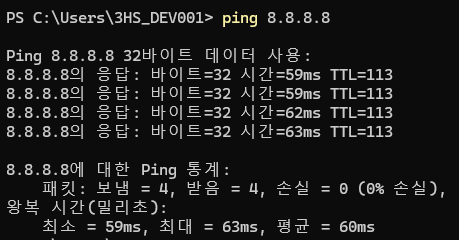

# 네트워크 기본 개념 학습

  
1. LAN과 WAN의 차이는 무엇인가요?

  

    <ul>
      <li>LAN (Local Area Network): 집, 회사, 학교 같은 한정된 공간 내에서 컴퓨터들이 연결된 네트워크.</li>
      <li>WAN (Wide Area Network): LAN 여러 개를 연결하여 더 넓은 네트워크를 형성하는 네트워크 (예: 인터넷).</li>
    </ul>
  

  
2. 라우터와 스위치의 차이는?

  

    <ul>
      <li>라우터는 서로 다른 네트워크 간의 트래픽을 라우팅(경로 설정)하는 역할을 해. WAN 통신에 필수적이야.</li>
      <li>스위치는 동일한 네트워크 내에서 데이터를 전달해 LAN 내에서만 작동해</li>
    </ul>
  

 

### 내 컴퓨터와 인터넷 통신 확인하기 (패킷이 제대로 가고 오는지 응답 시간 확인)

> 8.8.8.8은 구글의 DNS 서버 주소인데 네트워크 테스트를 위해 널리 사용되고 있다.

### 1. 인터넷 통신 확인

구글의 DNS 서버로 ping을 날리면 ICMP 요청 패킷이 전달되고 구글 DNS 서버로부터 ICMP 응답 패킷을 받게 됩니다. 즉, 패킷을 받았다는 건 인터넷망을 통해 통신에 성공했다는 의미입니다.

 

### 2. DNS 테스트

8.8.8.8에 더해 google.com 도메인으로 ping을 날려보면 DNS 상태를 체크할 수 있습니다. 만약 8.8.8.8로부터는 패킷을 전달받는데 google.com으로부터는 받지 못하면 인터넷 통신은 문제 없지만 DNS 서버에 문제가 있다고 인지할 수 있습니다.

 

### 3. 상세 설명

1. Ping 명령어 : 네트워크 장치나 서버와의 연결 상태를 확인하는 도구입니다. 특정 IP 주소로 작은 패킷을 보내고, 해당 장치가 응답하는지와 얼마나 시간이 걸리는지를 측정합니다.
2. 응답 : 바이트=32 시간=59ms TTL=113
   - 바이트=32 : Ping으로 보낸 데이터 크기가 32바이트라는 뜻입니다. (기본적으로 `ping`이 32바이트의 데이터를 전송합니다.)
   - 시간=59ms : 네 번의 Ping 중 가장 빠른 응답이 59 ms, 가장 느린 응답이 63ms, 평균 60ms로 안정적이라는 걸 의미
   - TTL=113 : TTL 128에서 113은 15만큼 이동했기 때문에 15개의 라우터를 거쳤다.
     - TTL(Time To Live) : 패킷을 처음 전송할 때 windows는 기본적으로 128로 설정된다.
