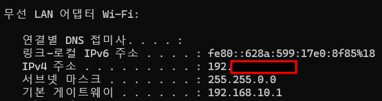

# IP 주소와 서브넷 이해 및 실습

- IP 주소 : 네트워크에서 각 장치에 부여된 고유 주소.
- 서브넷 마스크 : 네트워크를 더 작은 서브넷으로 나누기 위해 사용하는 값
- 기본 게이트웨이 : 다른 네트워크로 나가기 위한 출구 역할을 하는 라우터의 IP 주소

 

## 내 IP 주소와 서브넷 정보 확인하기

- Windows: cmd를 열고 `ipconfig` 명령어 입력.
- Linux/Mac: 터미널에서 `ifconfig` 명령어 입력.

 

### 1. IPv4 주소 : 192.**\*.**.\*\*\*

- `192.***.**.***`은 네트워크 상에서 내 컴퓨터가 가지고 있는 고유한 IP 주소다.
- 이 주소는 네트워크 안에 장치를 식별하는 데 사용된다. 즉, 네트워크에서 내 컴퓨터의 **주소**인 셈이다.

 

### 서브넷 마스크 : 255.255.0.0

- 서브넷 마스크는 **IP 주소를 네트워크 부분과 호스트 부분으로 나누는 기준**이다.
- 서브넷 마스크를 이진수로 변환하면 다음과 같다.
  - 255 = 11111111
  - 255 = 11111111
  - 0 = 00000000
  - 0 = 00000000
  - 서브넷 마스크는 IP 주소에서 앞의 16비트(192.xxx)가 **네트워크 주소**이고, 뒤의 16비트가 **호스트 주소**임을 나타낸다.
  - 쉽게 말해서
    - 192.xxx : 네트워크 주소 (아파트 단지 이름).
    - xx.xxx가 네트워크 안에서 내 장치를 나타내는 호스트 주소(아파트 호실 번호)입니다.

 

### 기본 게이트워이 : 192.168.10.1

- 기본 게이트웨이는 네트워크 바깥으로 나가기 위한 출구입니다.
- 네트워크 내부에 있는 다른 장치와 통신할 때는 기본 게이트웨이를 거치지 않지만, 인터넷이나 다른 네트워크로 데이터를 보내려면 기본 게이트웨이를 거쳐야합니다.

 
 

### 전체 요약

- **IPv4 주소** : 네트워크 안에서 내 장치의 고유 주소
- **서브넷 마스크** : 네트워크 주소와 호스트 주소를 나누는 기준
- **기본 게이트웨이** : 네트워크 바깥으로 나가는 출구 역할을 하는 라우터의 주소
