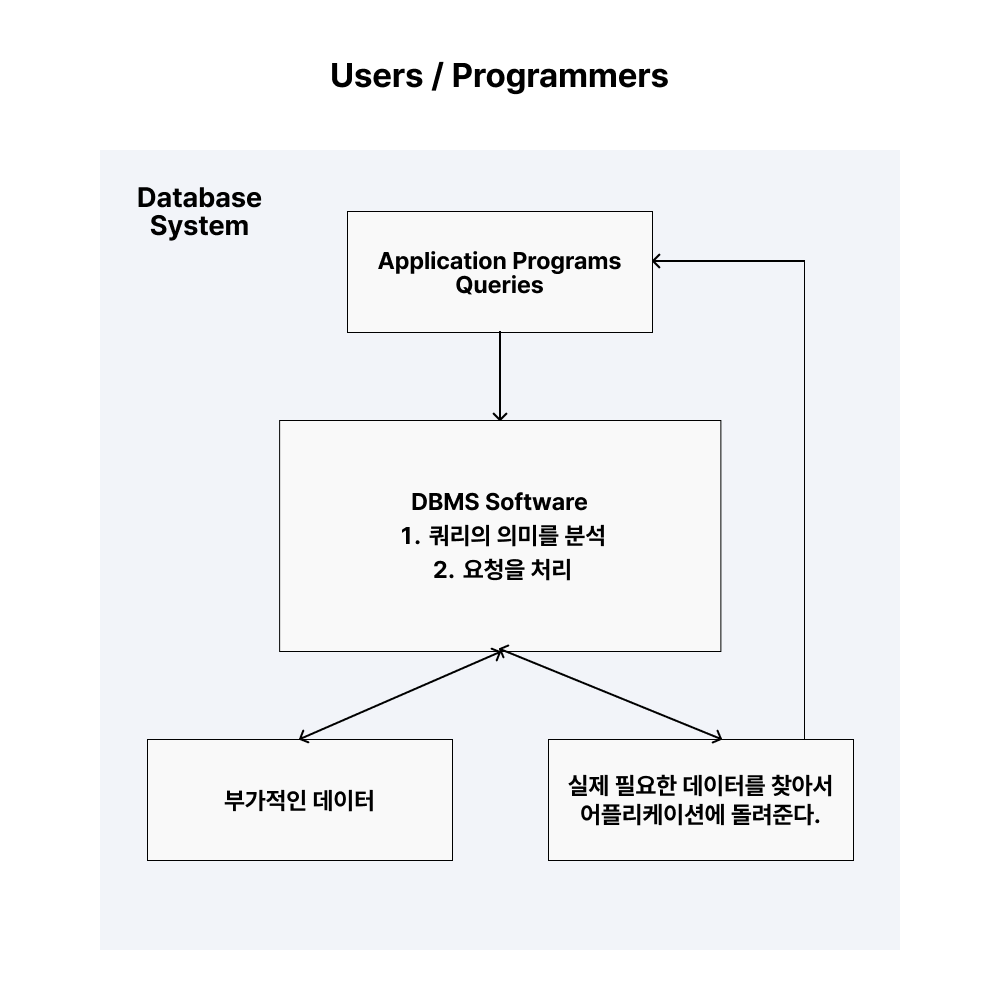
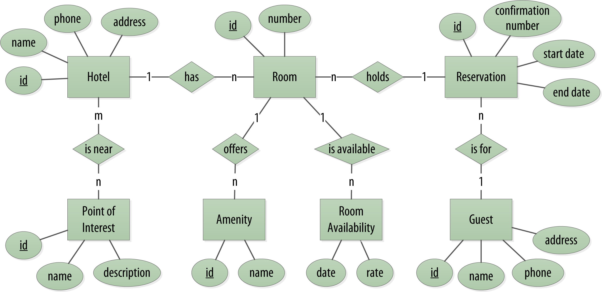
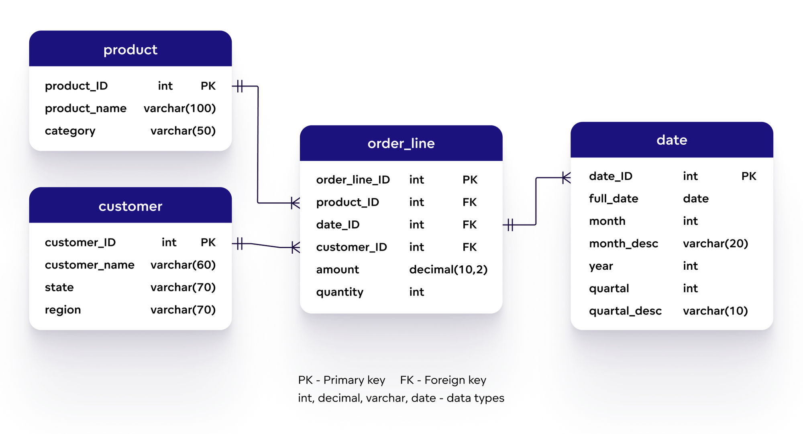
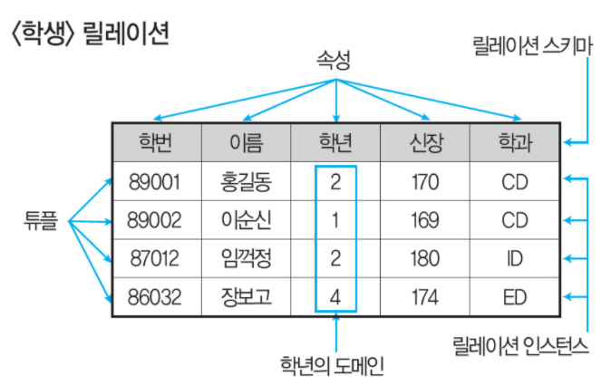

## database & DBMS & DB System
- database : 전자적으로 저장되고 사용되는 관련있는 데이터들의 조직화된 집합
- DBMS : 사용자에게 DB를 정의하고 만들고 관리하는 기능을 제공하는 소프트웨어 시스템 (Postgre, MySQL, MariaDB)
- database system : database + DBMS + 연관된 applications == database

   

## data model
- DB 구조를 추상화해서 표현할 수 있는 수단을 제공한다. (모델링)
- 여러 종류가 있으며 추상화 수준과 DB 구조화 방식이 조금씩 다르다.

### conceptual data models
- 비개발자까지도 쉽게 이해할 수 있는 개념들로 이뤄진 모델

### logical data models (relational data model)
- 이해하기 어렵지 않으면서도 디테일하게 DB를 구조화 할 수 있는 개념들을 제공하면서,
- 데이터가 저장될 때의 구조와 크게 다르지 않게 DB 구조화를 가능하게 한다.

### physical data models
- 컴퓨터에 데이터가 어떻게 파일 형태로 저장되는지를 기술할 수 있는 수단을 제공

   

## schema & state

### database schema - thead에 대응 (필드나 컬럼의 정의)
- data model을 바탕으로 database의 구조를 기술(description)한 것
- schema는 db 설계할 때 정해지며 정해지면 자주 바뀌지 않는다.

### database status -  tbody에 대응 (실제 입력된 값)
- database에 있는 실제 데이터는 꽤 바뀔 수 있다.
- 특정 시점에 db에 있는 데이터를 `database status` 혹은 `snapshot`이라고 하낟.

### Three-schema architecture
- 데이터베이스 관리 시스템(DBMS)에서 데이터가 여러 수준에서 어떻게 정의되고 관리되는지 설명하는 모델
  - **External Schema**: 사용자나 애플리케이션이 보는 데이터의 맞춤형 뷰 (개별적 관점)
  - **Conceptual Schema**: 데이터베이스의 전체 논리적 구조 (데이터 모델)
  - **Internal Schema**: 데이터의 물리적 저장 방법 (저장 장치에서의 레이아웃)

   

## database language
### DDL (data definition language)
- Conceptual Schema를 정의하기 위해 사용

### SDL (Storage definition language)
- Internal Schema를 정의하기 위해 사용
- 요즘은 SDL이 거의 없고 파라미터 등의 설정으로 대체
  
### VDL (view definition language)
- External Schema를 정의하기 위해 사용되는 언어
- 대부분의 DBMS에서는 DDL이 VDL 역할까지 수행

### DML (data manipulation language)
- database에 있는 data를 활용하기 위한 언어
- data 추가, 삭제, 수정, 검색 등의 기능을 제공

### 통합된 언어
- 오늘날의 DBMS는 DML, VDL, DDL이 따로 존재하기 보다는 통합된 언어로 존재한다.
- 대표적인 예가 Relational database language : SQL

   

## relational database
- Table을 이용해 데이터 상호 관계를 정의하는 데이터베이스이다.

## relational datab model - student relation

### 튜플 (Tuple)
- 릴레이션을 구성하는 **행**을 말한다.

### 속성 (Attribute)
- 데이터베이스를 구성하는 가장 작은 논리 단위이며 개체의 특성을 기술한다.

### 도메인 (Domain)
- 하나의 속성(Attribute)이 취할 수 있는 같은 타입의 원자들의 집합이다.

### relation의 특징들
- 중복된 tuple을 가질 수 없다.
- tuple을 식별하기 위해 attribute의 부분 집합을 key로 설정한다.
- tuple의 순서는 중요하지 않다.

