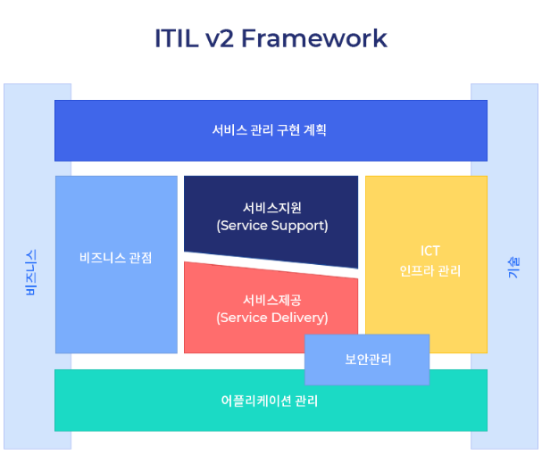
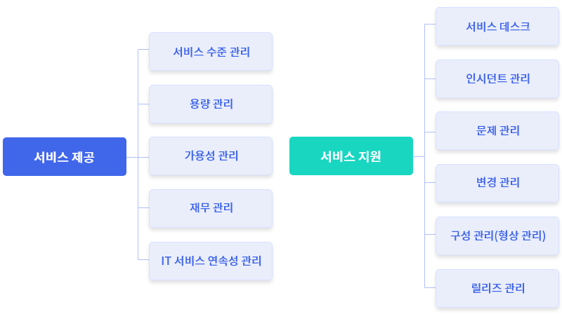
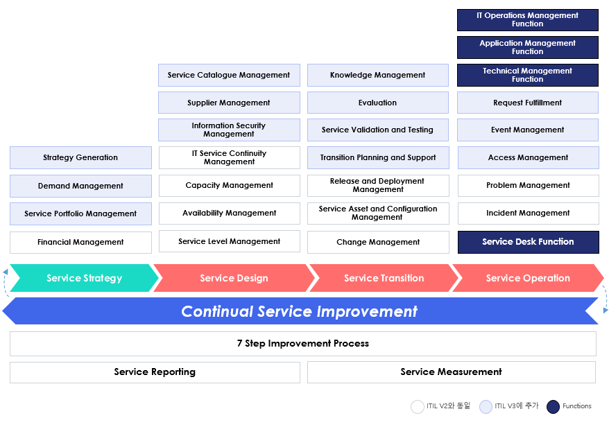

# ITIL (IT 정보 라이브러리)

## ITIL V1
1980년대 영국 정부는 CCTA(Central Computer and Telecommunications Agency)라는 정부 조직이 IT 자원을 효율적으로 활용할 수 있도록 하는 지침을 개발하도록 지시했다. 그 결과 오늘날 'ITIL'로 알려진 IT 조직을 위한 베스트 프랙티스 카탈로그의 초창기 모델이 만들어졌다.

## ITIL V2 - ITIL의 핵심 요소가 구성되다.
ITIL V2는 2000년부터 2001년 사이에 발표됐다. IT 관리, 응용 프로그램, 서비스 등  분야별 IT 프로세스 가이드 라인을 다루는 8권의 문서가 출판되었다.

IT 서비스 중심으로 고객에게 효과적인 서비스를 제공하는데 필요한 다방면의 프로세스를 정의한다. 사실상 현재 ITIL의 기본 틀이 모두 V2에서 마련되었다고 할 수 있다.

V2의 서비스 제공 및 지원 프로세스는 V3, V4에서도 여전히 핵심 요소로 기능하고 있다.

## ITIL V3 - 지속적 서비스 개선을 강조

ITIL V3의 라이프라이클 모델을 세부 프로세스와 기능 수준에서 보다 자세히 표현하면 위와 같다. 흰색으로 표시된 프로세스는 V2에 포함된 프로세스로, V3로 진화하며 5단계 라이프사이클에 포함되며 반복적으로 순환하는 구조를 따르게 되었다. 

## ITIL V4 - Service Lifecycle에서 Service Value System으로 변화하다.
2011년 ITIL V3 개정 후 전 세계적인 IT 환경 변화가 있었다. 클라우드 환경으로의 변화, DevOps의 등장 등 급속도로 변화하는 조직 내 IT 환경에 ITIL V3는 민첩한 대응이 어려웠다. 이에 따라 2019년 V3가 V4로 개정되었다. 서비스 가치 체계(Service Value System, SVS)가 도입되었고 프랙티스 중심의 IT관리, 클라우드 환경의 운영 절차가 강화되었다. 

| 참조 : https://blog.naver.com/gsitm2006/222397568756

# ITIL V4의 주요 특징
ITIL V3의 핵심적인 변화는 5단계(서비스 전략→서비스 설계→서비스 전환→서비스 운영 및 지속적인 서비스 개선)로 구성된 ‘서비스 라이프사이클’의 도입이었다. ITIL V3의 세부 프로세스는 서비스 라이프사이클에 잘 녹아 들었다. 이렇게 지속적 서비스 개선에 초점을 맞춰 ITIL 프로세스를 구성하는 방식은 데밍 사이클(Deming Cycle)로 알려진 PDCA(Plan-Do-Check-Act) 사이클과 매우 유사하다. 

반면 ITIL V4는 ‘서비스 가치 사슬(Service Value Chain)’을 중심으로 기본 구조와 개념을 변경하였다. 프로세스 중심의 서비스 라이프사이클에 관한 내용 대부분을 삭제하고 프랙티스 중심, 가치 중심으로 적용 방법을 바꿨다. 이는 IT 서비스가 적용되는 조직의 업무 현실에 더욱 부합하는 방향으로의 변화라고 볼 수 있다. 또한 ITIL V4는 사일로(Silo) 감소, 협업 증가, 조직 커뮤니케이션 촉진, 애자일(Agile) 및 데브옵스(DevOps) 등을 ITSM 전략에 통합하도록 장려했다. 이렇듯 사용자 정의가 가능하도록 설계의 유연성을 높인 것이 눈에 띄는  ITIL V4의 특징이라고 할 수 있다.

