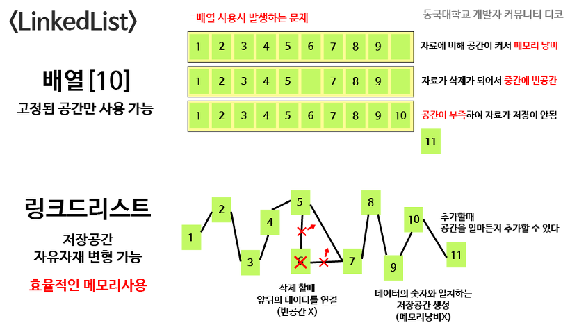
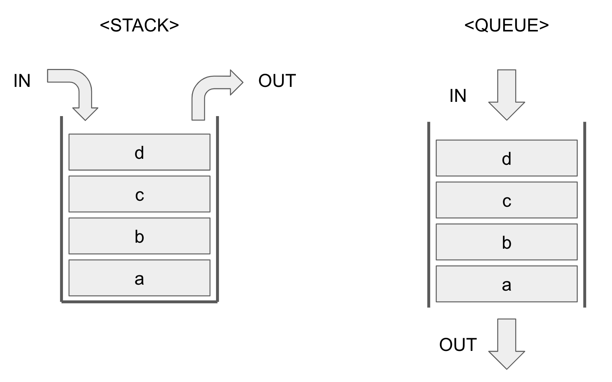
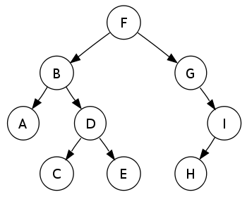

# 자료구조
데이터가 많아질 때 이를 어떻게 정리하느냐에 따라 데이터를 찾는 속도와 관리의 편리성이 달립니다. 즉, 자료구조는 데이터를 **조직하고 정리하는 방식**입니다. 

```
도서관처럼 많이 보이는 정보는 베스트셀러에 넣고, 일반 도서들은 주제에 맞게 분류하고 많이 사용하지 않는 자료는 창고에 넣되 분류를 하여 넣어두기에 접근성이 좋습니다.
```

## 다양한 종류의 자료구조들
### 1. 배열
> 줄지어 정리된 서류함

### 2. 리스트
> 데이터를 순서대로 나열한 자료구조


- 배열과 다른점은 화살표로 서로 연결되어 있어 데이터들이 떨어진 장소에 위치해도 된다는 점이다.
  - 단방향 리스트
  - 양방향 리스트
  

### 3. 스택
> 서류를 차곡차곡 쌓아두는 서랍

가장 나중에 쌓은 서류가 제일 먼저 꺼내지는 LIFO 구조입니다.

### 4. 큐
> 차례를 기다리는 대기열

점심시간때 배식 줄을 기다리는 것과 같습니다. 먼저 들어온 사람이 먼저 음식을 받는 FIFO 구조입니다.




### 5. 해시맵
> 키워드로 빠르게 찾기

각 자료의 고유한 키가 있어서, 그 키를 입력하면 바로 해당 자료에 접근할 수 있습니다.

### 6. 트리
| 트리는 자연에서의 나무의 반대의 모양이다. 즉, 모든 트리는 위에서 아래로 자란다.



<br>

## 자료구조의 실제 사용 예시

- **배열** : 직원들의 성적을 **순차적으로 관리**할 때 유용합니다.
- **연결 리스트** : 자주 추가/삭제가 필요한 경우, 프로젝트에서 **매번 새로운 업무**가 추가될 떄 유용합니다.
- **스택** : 블록쌓기처럼, 가장** 마지막(최신)에 받은 서류**부터 검토하는 업무에 유용합니다.
- **큐** : 고객 문의를 **접수된 순서대로** 처리할 때 유용합니다.
- **해시맵** : 데이터를 **빠르게 조회**할 필요가 있을 때, 직원들의 정보에 **고유한 키**로 접근해야 할 때 유용하다.


## 결론
상황에 맞는 자료구조를 선택하면 **효율적인 데이터 처리** (**어떤 방식으로 데이터를 관리할지를 결정**)가 가능합니다.
