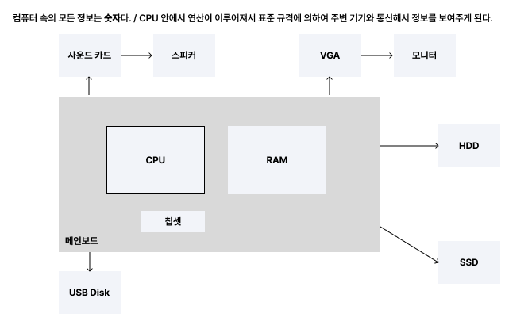
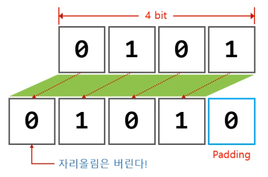
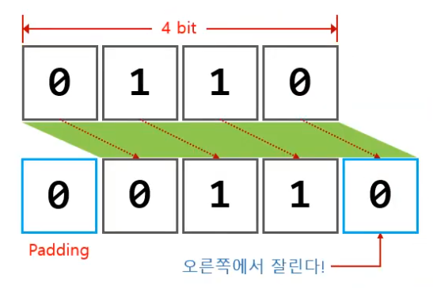

# 하드웨어 파트
### 컴퓨터 == CPU - 1비트와 진법변환을 알아야하는 이유
1. 우리가 말하는 컴퓨터는 사실상 CPU를 말하는 것이다.
2. 그렇다면 CPU의 구조를 알아야한다. == 컴퓨터의 구조
3. CPU 구조를 알기 위해서는 **1비트**와 **진법변환**을 할 줄 알아야한다.

 

### 컴퓨터 관련 기본 용어 정리
- **CPU (Central Processing Unit)**: 컴퓨터의 핵심 연산 장치로 모든 명령을 처리.
- **RAM (Random Access Memory)**: 프로그램과 데이터를 임시로 저장하는 메모리.
- **HDD/SSD**: 데이터를 영구적으로 저장하는 장치. HDD는 기계식, SSD는 반도체 기반.
- **Main Board (Motherboard)**: 컴퓨터의 모든 부품을 연결하는 중심 보드.
- **칩셋** : CPU와 RAM, 저장 장치 간의 데이터 흐름을 관리.
- **주변 기기 인터페이스** : USB, 모니터, 키보드, 사운드 카드 등 외부 장치를 연결.

### 컴퓨터 하드웨어 구성요약

 
 

### 컴퓨터는 왜 2진법을 사용할까
컴퓨터 내부는 전기가 흐르는 상태(1)와 흐르지 않는 상태(0)로 구분돼. 이 두 가지 상태를 이용해서 정보를 처리하고 저장하기 때문이다.

 

### 1비트/바이트란 무엇인가?
- 1 비트란 '전기 스위치 1개'를 의미한다.  
  - 전기가 흐르면 1(On) / 전기가 흐르지 않으면 0(Off)
- 8개 비트를 하나로 묶어 **1 바이트(Byte)** 라고 한다. 0 0 0 0 0 0 0 0
- 1 바이트는 영문자 한 글자가 저장될 수 있는 메모리 크기이다.
- 2^32 = 32 bit를 의미한다. 즉, 32비트 구조의 한계 용량은 4GB이다.

**여러 비트를 조합함으로써 큰 수를 표현할 수 있다. 예를 들어 4비트는 0에서 2의 4제곱 빼기 1까지 표현한다.**

 

### 2진수, 16진수, 10진수 그리고 진법변환
진법변환 : 2비트를 10비트, 10비트를 2비트 등으로 바꾸는 것이다.

2진수| - |-| - |10진수|16진수
---|---|---|---|---|---|
0| 0 |0| 0 |0|0
0| 0 |0| 0 |1|1
·| · |·| · |·|·
1| 0 |0| 1 |9|9
1| 0 |1| 0 |10|A
1| 0 |1| 1 |11|B
·| · |·| · |·|·
1| 1 |1| 1 |15|F

### 4비트와 16진수의 관계
- 4비트는 컴퓨터에서 데이터를 처리할 때 가장 작은 단위 중 하나입니다.
- 4비트는 16진수로 모두 표현할 수 있다.
  - `0 0 0 0 = 0` 에서 `1 1 1 1 = 15`까지 표현 가능
-  이 값은 16진수의 한 자리 숫자로 대응됩니다.

단위|크기|특징
---|---|---|
1 Bit | 전기 스위치 1개 | 용량이 아니라 **표현의 최소 수준**이다.
1 Byte | 8비트 한 묶음 | - 영문자 한 글자를 저장할 수 있는 **기억 공간의 최소단위이다.**   - 컴퓨터는 기억 공간을 관리할 때 1바이트 단위로 관리한다.
1 KB | 1024 바이트 | 보통 JPEG 사진 파일 하나가 몇 백 KB 정도 된다.
1 MB | 1024 킬로바이트 | MP3 파일 하나가 대략 4~5 MB 정도 크기이다.
이후 1GB / 1TB / 1PB / 1EB / 2ZB / 1YB 가 있다.

 
 

## 이해보다 일단 암기할 것.

- 8개의 비트를 하나로 묶어 1 바이트(Byte)라고 한다.
- 영문자 한 글자는 1 바이트, 한글 한 글자는 2 바이트가 있어야 저장할 수 있다.
- 2의 10 제곱은 1024이다.
- 2의 32 제곱은 4,294,967,297 바이트이고, 이건 4GB이다.
- 2의 32 제곱은 **32 bit**를 의미한다. 즉, 32비트 구조의 한계 용량은 4GB이다.
- 4비트는 16가지, 8비트는 256가지, 16비트는 65,536가지(64KB)이다.

  
2진수 11000011을 10진수로 표현하기

  

    <ol>
      <li>네 자리(4비트)씩 잘라서 16진수로 바꿔보자</li>
      <li>16진수를 10진수로 바꾼다.</li>
      <li>그렇다면 정답은?</li>
    </ol>
  

 
 

# CPU가 작동하는 원리
### 디지털 회로 (AND, OR, XOR, Not)
> 반도체는 전기가 흐르는 도체와 흐르지 않는 부도체 성격을 조건에 따라 선택할 수 있다.
- 반가산기
- 전가산기

### 보수 - 덧셈만 할 줄 알면 모든 게 끝난다.
보수는 컴퓨터가 뺄셈을 처리하는 방식에서 중요한 개념입니다. 컴퓨터는 기본적으로 덧셈 연산만 할 수 있지만, **보수**를 이용하면 덧셈만으로 뺄셈도 할 수 있습니다.

**10진수에서의 보수**   
- **10의 보수**란, 어떤 숫자를 10에서 뺀 경과 입니다.
  - 예. 9 + 1 = 10에서 1이 9의 보수입니다.
  - 만약 12 - 9를 계산할 때, `9의 보수인 1을 더하면 12 + 1 = 13`이 되고, **위의 자릿수를 무시**하면 정답은 3이 됩니다.
    - 즉 12 - 9 뜨는 9의 보수를 더한 값 12 + 1 = 13(윗 자리수를 뺸 값) = 3

**2진수에서의 보수**   
컴퓨터는 2진수를 사용하기 때문에 **2의 보수**를 활용합니다.   
2의 보수를 계산하는 방법은 두 가지 단계로 이루어집니다.
1. **1의 보수 구하기** : 모든 비트를 반전(0은 1로, 1은 0으로) 시킵니다.
2. **2의 보수 구하기** : 1의 보수에 1을 더합니다.

**예시. 3 - 2를 2의 보수로 계산하기**   
1. 3을 2진수로 표현 : 0 0 1 1
2. 2를 2진수로 표현 : 0 0 1 0
3. 2를 1의 보수로 변환 : 1 1 0 1
4. 여기에 2의 보수로 변환 : 1 1 1 0
5. 이제 3에 2의 보수를 더합니다 : 
   - 0 0 1 1 + 1 1 1 0 = 1 1 1 0 1
   - 결과는 5비트이므로 **가장 왼쪽 비트를 버리면** 0 0 0 1 = 1이됩니다.
6. 결과적으로 3 - 2 = 1이 정확하게 계산됩니다.

> 그래서 컴퓨터는 Not을 취해서 + 1을 하면 가산 개념이고 보수를 더하면 자동으로 빼기가 됨으로 더하면 자동으로 빼진다.

## 컴퓨터에서 곱셈과 나눗셈 처리 방법
컴퓨터는 곱셈과 나눗셈을 효율적으로 처리하기 위해 **Shift 연산**과 **가산기(덧셈)**를 활용합니다.   
이 과정에서 디지털 회로를 통해 여러 번의 더하기와 빼기 연산을 반복하게 됩니다.

### 컴퓨터가 곱셈하는 방법
- **Shift** : 곱셈은 비트를 왼쪽으로 밀기(Shift)를 통해 간단하게 처리가 가능합니다.
  - 예. 2를 곱하는 것은 비트를 한 번 왼쪽으로 밀면 됩니다.
    - 0 0 1 0 = 2를 왼쪽으로 밀면 0 1 0 0 = 4가 된다.
- **덧셈** : 컴퓨터의 곱셈은 여러 번 더함으로써도 처리할 수 있습니다.
  - 예. 3 * 4 = 3 + 3 + 3 + 3과 같다.

 

### 컴퓨터가 나눗셈하는 방법
- **Shift** : 나눗셈은 비트를 오른쪽으로 밀기(Shift)를 통해 간단하게 처리가 가능합니다.
    - 예. 1 0 0 0 = 8을 오른쪽으로 밀면 0 1 0 0 = 4가 된다.
- **뺄셈** : 컴퓨터의 나눗셈은 여러 번 빼는 방법으로도 처리할 수 있습니다.
    - 예. 12 / 4 = 12 - 4 - 4 - 4 = 0으로, 4를 3번 빼니까 몫은 3이 됩니다.

 

| 모든 컴퓨터라는 기계는 게이트회로고 가산기를 만들면 된다.

# 8
기억장치에 대한 이해

> 기억장치 : 정보 혹은 자료를 담아두는 저장공간을 뜻한다.
>> 특성 : 속도, 휘발성

CPU가 연산을 할 건데 하기 위한 정보를 HDD에서 RAM에 보내고 해당 자료를 계산해서  다시 RAM에 보내고 화면 같은 입/출력 장치에 출력해준다.

 

# 9
파일 시스템

 

# 10

 

# 8

**우리가 사용하는 것들**
1. 프로그래밍 언어
  1. 고급 언어 : 파이썬 자바, C 같은 언어다.
  2. 컴파일 : 고급 언어로 작성된 코드를 컴퓨터 언어인 기계어(0과 1)로 변환하는 과정이다.
2. 디지털 정보 표현
  1. 텍스트 : 아스키 코드나 유니코드 같은 표준을 사용한다.
    - 'A'는 아스키 코드에서 65로 표현되고, 65는 이진수로 '01000001'이 된다.
  2. 이미지 : 이미지는 픽셀로 이루어져 있고, 픽셀은 색상을 가지고 있는데 색상은 0과 1로 표현된 값으로 저장된다.
  3. 소리 : 소리는 샘플링이라는 과정을 통해 시간에 따라 변화하는 아날로그 신호를 디지털 신호(이진수)로 변환해 저장한다.

이처럼 컴퓨터는 텍스트, 이미지, 소리 등 다양한 정보를 모두 0과 1의 조합으로 표현하고, 이걸 바탕으로 우리가 사용하는 프로그램이나 파일을 처리해요. 개발자는 이러한 원리를 이해하고, 데이터가 어떻게 변환되고 처리되는지를 알아야 더 효율적으로 프로그래밍할 수 있습니다.

 
 
 
 
 

---

 

  
ㅇㅇㅇㅇㅇㅇㅇㅇ

  

    
ddddd

  

